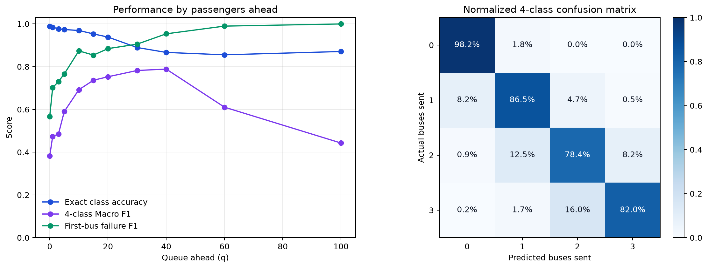

# 대기열과 좌석 불확실성을 고려한 광역버스 탑승 가능성 예측

## 초록

상용 지도앱에서 버스 탑승이 가능한지를 판단하기 위해 사용할 수 있는 정보는 버스가 지금 있는 위치에서 관측된 잔여좌석 뿐이다. 버스가 사용자가 기다리는 정류장까지 오는 동안 앞선 정류장에서 승객이 타면 좌석은 사라지고, 입석이 제한된 광역버스는 만차일 경우 정차하지 않기 때문에, 승객은 대기 후에도 버스를 탑승하지 못하게 된다. 승객은 이전 정류장에서 얼마나 탑승할지 모르기 때문에 지각이나 추가 대기를 감수하지만, 도착 시 탑승 실패 위험을 미리 알면 다른 버스·노선·정류장·출발시각을 선택할 수 있다.

이 문제는 수집한 데이터에서도 확인된다. 2026년 8월 3일부터 14일까지 주말과 공휴일을 제외한 정류장 도착 사건 48,083건 중 만차는 445회 발생했다. 오전 7시에는 113회, 오후 6시에는 118회 발생해 전체 만차의 51.9%가 두 시간대에 집중되었다.

만차 445건 중 374건(84.0%)은 도착 전 관측에서 좌석이 남아 있었고, 이 사례들의 도착 전 최대 잔여좌석 중앙값은 39석이었다. 날짜별로 이전 평일만 사용하는 과거 30분대 평균은 만차 재현율 5.26%, F1 점수 8.70%에 그쳤다. 즉 과거의 기록만으로는 사용자가 피하고 싶은 희소한 탑승 실패를 충분히 경고할 수 없다.

우리는 이러한 문제를 해결하기 위한 다음과 같은 예측 모델을 제시한다. 도착 잔여좌석 앙상블이 제공하는 안정적인 중심값과 14개 구간으로 나눈 좌석 확률분포를 혼합하고, 동시에 보이는 다음 세 대의 분포를 합성곱하여 누적 탑승확률과 탑승 성공 시까지 통과 대수 $[0, 1, 2, 3대 이상]$를 예측한다.

모델 테스트 결과 전체 정확도는 93.35%, Macro F1 점수는 86.74%, 첫 버스 탑승 실패 F1 점수는 95.74%였다. 극단적인 대기열을 제외한 중간 구간에서도 평균 F1 점수 81.59%를 기록했다.

---

## 1. 현재 잔여 좌석과 도착 시 잔여 좌석의 불일치

### 1.1 시점의 불일치로 인한 탑승 실패

사용자가 앱을 확인하는 시점 $t_0$와 버스가 사용자의 정류장에 도착하는 시점 $t_1$ 사이에는 이동 구간과 여러 상류 정류장이 있다. 현재 잔여좌석 $S(t_0)$은 사실이지만, 사용자가 필요한 정보는 도착 잔여좌석 $S(t_1)$과 자신의 탑승 가능성이다. 그 사이 승하차의 순변화를 $\Delta S(t_0,t_1)$라 하면

$$
S(t_1)=S(t_0)+\Delta S(t_0,t_1)
$$

이다. $\Delta S(t_0,t_1)$는 노선·방향·정류장·시간과 당일 운행 상태에 따라 달라진다. 따라서 현재 잔여 좌석이 존재한다는 사실만으로 승객의 해당 버스 탑승 가능 여부를 예측할 수 없다. 도착 시 버스가 만차라면 입석 제한 노선의 중간 정류장 승객은 기다린 버스를 보내고 다음 버스를 기다려야 한다.

실제로 정부는 2024년 “광역버스 만차로 인한 무정차 통과”를 중간 정류장 탑승 문제로 명시하고 중간배차와 좌석예약제를 확대했다. ([국토교통부, 2024 교통 민생토론회](https://www.molit.go.kr/2024plan_traffic/total/total_02.jsp)) 그럼에도 최근 사례는 계속 확인된다.

2025년 5월 고양시는 이 프로젝트의 수집 대상과 동일한 1000번 직행좌석버스가 상류부 일산에서 이미 만석이 되어 하류부 행신동 주민들이 정류장에서 연이어 승차하지 못했다고 밝혔다. 시는 입석 금지 전후 승차 불가 인원 데이터를 근거로 전세버스 2대 추가 투입, 중간배차 6회 유지, 2층 전기버스 5대 도입 등의 대책을 시행했다. 이는 본 연구가 다루는 노선과 동일한 상하류 구조에서 실제 탑승 실패가 발생했음을 보여준다. ([고양특례시](https://www.goyang.go.kr/news/user/bbs/BD_selectBbs.do?q_bbsCode=1090&q_bbscttSn=20250528175838574&q_estnColumn1=All), [뉴시스, 2025-05-28](https://www.newsis.com/view/NISX20250528_0003193302))

2026년 3월에는 경기도 공식 청원 게시판에 광역버스가 평일과 주말 모두 만차로 도착해 다음 차량을 한 시간 이상 기다려야 한다는 청원이 올라왔고 196명이 참여했다. ([경기도청원, 2026-03-16](https://petitions.gg.go.kr/view/?pageid=28&uid=27944))

증차, 중간배차, 좌석예약제는 필요한 대응이지만 모든 시간대와 정류장의 만차를 없애기는 어렵다. 출퇴근 시간 밖에는 수요가 크게 줄어 무조건적인 증차가 비용 측면에서 지속되기 어렵고, 운수종사자와 차량 수도 제한돼 있기 때문이다. 공공기관의 공급 대책만으로 문제가 완전히 해소되기를 기다리기보다, 승객도 버스가 도착하기 전에 탑승 실패 가능성을 확인하고 다른 버스·노선·정류장·출발시각을 선택할 수 있어야 한다. 이 모델은 공급 정책의 한계를 인정하고, 남아 있는 불확실성 안에서 승객이 문제를 주체적으로 회피하도록 돕는 정보 수단이다.

### 1.2 만차의 희소성과 집중

우리는 사례에서 확인한 문제가 수집 데이터에서는 어떤 형태로 나타나는지 분석했다. 범위는 수집 시작일인 2026년 8월 3일부터 14일까지의 평일이며, 주말인 8월 8~9일과 8월 15~16일은 제외했다. 8월 17일은 광복절 대체공휴일이면서 동결 개발자료의 기준시점 이후이므로 처음부터 분석에 포함되지 않았다. 8월 18일 데이터는 최종시험용이므로 데이터 누수를 막기 위해 포함하지 않았다.

노선 수집은 순차적으로 시작됐다. 8월 3~5일에는 1000번, 8월 6~7일에는 1000·1100번이 수집됐고, 6개 노선이 모두 수집된 공통 구간은 8월 10~14일이다. 따라서 전체 기간 통계 48,083건은 문제의 총 관찰 횟수를 보여주는 데 사용하고, 노선 간 공정한 비교에는 공통 수집 구간 39,616건을 사용했다. 전체 기간에 포함된 노선은 1000·1100·1200·1500·2000·3000번이며 제외 노선은 없다.

| 범위 | 도착 사건 | 만차 사건 | 만차율 |
|---|---:|---:|---:|
| 전체 평일 수집 구간 | 48,083 | 445 | 0.93% |
| 6개 노선 공통 수집 구간 | 39,616 | 372 | 0.94% |
| 오전 7시·전체 평일 | 4,042 | 113 | 2.80% |
| 오후 6시·전체 평일 | 4,613 | 118 | 2.56% |
| 3000번·복귀·오후 6시 | 247 | 33 | 13.36% |
| 3000번·도심행·오전 7시 | 265 | 31 | 11.70% |
| 3000번·복귀·오후 7시 | 299 | 28 | 9.36% |
| 1000번·복귀·오후 6시 | 959 | 53 | 5.53% |

전체 만차율 0.93% 자체는 높지 않지만, 만차 분포는 출퇴근 시간 및 일부 노선·방향에 집중돼 사용자 경험상 반복적인 실패가 된다. 오전 7시와 오후 6시에만 231회의 만차가 발생해 전체 445회의 51.9%를 차지했다. 특히 만차 445건 중 374건(84.0%)은 이전 정류장 관측에서 좌석이 양수였으나 목표 정류장으로 이동하면서 만차로 변한 사례다. 이들의 도착 전 최대 잔여좌석은 중앙값 39석, 90백분위 44석이었다. 즉 사용자가 앱에서 많은 잔여좌석을 확인한 버스도 대기 중인 정류장에 도착할 때는 만차가 될 수 있었다.

이를 통해 현재 좌석이 남아 있지만 도착 시 만차가 되는 사건이 존재하며, 특정 통근 구간에 집중됨을 확인할 수 있다.

### 1.3 과거 기록 평균의 한계

두 가지 단순 기준선은 6개 노선이 모두 관측되고 최소 한 평일의 과거 기록이 확보된 2026년 8월 11일부터 14일까지 31,722개 도착 사건에서 순차 검증했다. 각 평가일마다 그 날짜보다 앞선 평일만 사용했으므로 같은 날이나 미래 정보는 평균에 들어가지 않는다. 8월 10일은 6개 노선의 첫 공통 평일로서 초기 과거 기록에만 사용했다.

`과거 30분 평균`은 과거 도착 기록의 노선·방향·목표 정류장·시간대 별 평균을 사용하고, 표본이 없을 때 노선·방향·시간대 → 노선 → 전체 평균 순으로 대체했다. `현재 좌석 유지`는 관측 좌석이 목표 정류장까지 바뀌지 않는다고 가정했다. 평균절대오차와 분류 지표에는 사건마다 총 가중치가 같도록 가중치를 적용했고, 만차 판정 임계값은 예측 좌석 $\le0.5$다.

| 기준선·집계 | 전체 MAE | 저잔여($\le10$) MAE | Accuracy | Recall | Precision | F1 |
|---|---:|---:|---:|---:|---:|---:|
| 과거 30분 평균·전체 통합 | 4.83 | 10.09 | 98.94% | 5.26% | 25.00% | 8.70% |
| 과거 30분 평균·노선 평균 | 4.59 | 10.26 | 99.00% | 2.75% | 9.00% | 4.21% |
| 현재 좌석 유지·전체 통합 | 5.98 | 11.40 | 97.43% | 44.72% | 17.36% | 25.01% |
| 현재 좌석 유지·노선 평균 | 5.99 | 14.39 | 97.47% | 39.64% | 14.20% | 19.14% |

| 노선 | 기준선 | 전체 MAE | 저잔여 MAE | Accuracy | Recall | Precision | F1 |
|---:|---|---:|---:|---:|---:|---:|---:|
| 1000 | 과거 30분 평균 | 6.21 | 12.17 | 98.59% | 0.00% | 0.00% | 0.00% |
| 1100 | 과거 30분 평균 | 2.93 | 8.48 | 99.84% | 0.00% | 0.00% | 0.00% |
| 1200 | 과거 30분 평균 | 4.68 | 9.14 | 98.41% | 1.52% | 4.00% | 2.20% |
| 1500 | 과거 30분 평균 | 4.40 | 9.32 | 99.58% | 0.00% | 0.00% | 0.00% |
| 2000 | 과거 30분 평균 | 3.90 | 14.19 | 99.93% | 0.00% | 0.00% | 0.00% |
| 3000 | 과거 30분 평균 | 5.41 | 8.26 | 97.66% | 15.00% | 50.00% | 23.08% |
| 1000 | 현재 좌석 유지 | 5.31 | 11.50 | 97.29% | 41.76% | 23.77% | 30.30% |
| 1100 | 현재 좌석 유지 | 4.39 | 24.65 | 99.74% | 14.15% | 7.40% | 9.72% |
| 1200 | 현재 좌석 유지 | 5.97 | 11.97 | 97.76% | 33.54% | 21.46% | 26.17% |
| 1500 | 현재 좌석 유지 | 7.89 | 12.45 | 95.49% | 62.12% | 3.94% | 7.41% |
| 2000 | 현재 좌석 유지 | 5.71 | 16.69 | 99.59% | 31.79% | 4.34% | 7.64% |
| 3000 | 현재 좌석 유지 | 6.64 | 9.08 | 94.96% | 54.48% | 24.30% | 33.61% |

우리는 높은 정확도에 주목했다. 만차가 희소하므로 항상 “만차 아님”을 예측했을 때도 정확도가 높다. 과거 평균은 98.94%의 정확도를 보였지만 실제 만차 304건 중 16건만 포착했다. 현재 좌석 유지는 만차의 44.72%를 포착했지만, 경고의 82.64%가 오경보였다. 따라서 평균이나 현재 상태의 유지로는 좌석 변화의 예측이 힘들며, 현재 상태에서 목표 정류장까지의 좌석 변화를 예측하고 희소한 실패 위험을 확률로 전달할 수 있는 모델이 필요하다.

### 1.4 사전 정보가 실제 선택을 바꿀 수 있는가

선행연구는 이 정보가 사용자 행동으로 이어질 수 있음을 뒷받침한다. Yap과 Cats(2021)는 탑승 거부로 생긴 추가 대기 1분이 최초 대기 1분보다 68% 더 부정적으로 평가됐고, denied boarding이 특정 장소·좁은 시간대에 집중되면서도 불확실하다고 보고했다. ([DOI](https://doi.org/10.1016/j.tra.2021.02.007)) Islam과 Fonzone(2021)의 에든버러 버스 이용자 조사에서는 실시간 정보를 이용한 사람의 약 55%가 출발시각·탑승시각·정류장·노선 등 여정의 적어도 한 요소를 바꿨다. ([DOI](https://doi.org/10.1016/j.tbs.2021.01.001)) Drabicki, Cats와 Kucharski(2025)는 실시간 혼잡 정보가 있을 때 혼잡한 첫 차량을 타는 대신 좌석 가능성이 높은 다음 차량을 기다리는 선택이 나타남을 보였다. ([DOI](https://doi.org/10.1016/j.tbs.2024.100895))

따라서 서비스의 목표는 “몇 석으로 보이는가”를 반복하는 것이 아니다. 사용자가 아직 다른 버스·노선·정류장·출발시각을 선택할 수 있을 때, 내 정류장 도착 시 탑승 실패 가능성을 알려주는 것이다.

## 2. 해결 과제의 형식화

사용자 앞 대기 인원을 $q$, 도착 순서대로 보이는 버스 3대의 실제 여유 좌석을 $S_1,S_2,S_3$라고 하자. 사용자가 $k$번째 버스 또는 그 전에  탑승하는 사건을 $B_k$라고 할 때, 탑승 가능 조건은 다음과 같다.

$$
P(B_k)=P\left(\sum_{i=1}^{k}S_i \ge q+1\right)
$$

통과 대수 $T$는

$$
T=\min\left\{k-1:\sum_{i=1}^{k}S_i\ge q+1\right\}
$$

이며, 보이는 3대 안에 타지 못하면 서비스 출력에서는 `3대 이상`으로 표시한다. 모델이 분류하는 등급은 다음 네 가지다.

| 클래스 | 사용자 의미 | 모델 사건 |
|---:|---|---|
| 0 | 첫 버스 탑승 | $S_1\ge q+1$ |
| 1 | 한 대 통과 | $S_1<q+1\le S_1+S_2$ |
| 2 | 두 대 통과 | $S_1+S_2<q+1\le S_1+S_2+S_3$ |
| 3 | 3대 안에 못 탐 | $S_1+S_2+S_3<q+1$ |

## 3. 선행연구: 혼잡도 예측에서 개인의 탑승 가능성으로

대중교통 혼잡도 연구는 먼저 차량이 미래 정류장에 도착할 때의 승객 수를 정확히 예측하는 문제에서 출발했다. Wood, Yu와 Gayah(2023)는 실시간 자동승객계수, 운행 정보, 날씨를 이용해 개별 버스의 미래 승객 수를 선형회귀와 랜덤 포레스트로 예측했다. 바로 다음 정류장을 반복해서 예측하는 방식보다 현재 정류장과 목표 정류장의 관계를 직접 학습하는 방식이 하류 정류장에서 더 정확했지만, 다른 시기로의 이전 가능성은 수요 패턴이 안정적일 때 높았다. Gallo, Corman과 Sacco(2022)는 과거 승객 수와 현재 지연에 실시간 차내 승객 관측을 추가하고, 여러 노선의 관계를 함께 학습하는 LightGBM 모형을 제안했다. 실시간 관측은 최대 8~9개 정류장 앞의 혼잡도 예측을 개선했으나, 승하차 변동이 큰 중심 환승정류장을 지난 뒤에는 예측력이 저하됐다. 두 연구는 현재 관측을 단순히 유지하는 것보다 하류 구간의 변화를 학습해야 한다는 근거를 제공하지만, 출력은 예상 승객 수나 혼잡 수준이므로 만차처럼 희소한 사건의 확률이나 정류장 대기열에 따른 탑승 성공 여부를 직접 설명하지는 않는다.

차량 혼잡도를 승객에게 의미 있는 정보로 변환하려는 연구도 이루어졌다. Jenelius(2020)는 과거 승객 수와 실시간 차량 위치·승객 수를 결합해 탑승 시 좌석을 얻을 확률, 예상 입석시간, 혼잡으로 증가하는 체감시간을 산출했다. 이는 차량 전체의 평균 혼잡도를 제시하는 데서 나아가 승객의 탑승 정류장과 이동 구간에 맞춘 정보를 제공했다는 점에서 본 연구와 직접 연결된다. 그러나 이 연구가 다룬 핵심 사건은 버스에 탑승한 뒤 좌석을 얻는가에 가까우며, 입석이 금지된 광역버스에서 앞선 대기 승객 때문에 차량에 아예 타지 못하는 사건은 별도의 문제다. 또한 한 차량의 좌석 가능성을 넘어 다음 여러 차량까지 얼마나 기다려야 하는지는 출력하지 않는다.

최근에는 혼잡도 예측의 불확실성을 직접 표현하려는 시도가 나타났다. Chen et al.(2025)은 인접 버스의 이동시간과 승객 수를 베이지안 상태전환 시계열 모형으로 함께 예측했다. 이 방법은 버스 운행자료에 나타나는 다봉성과 비대칭성을 확률분포로 표현함으로써 단일한 예상값에 의존하던 기존 연구를 확장했다. 불확실성을 포함한 승객 수 예측이라는 점에서는 본 연구와 가장 가깝지만, 최종 예측 대상은 여전히 차량의 이동시간과 차내 승객 수다. 예측분포를 특정 사용자의 대기순번과 결합해 탑승 성공확률로 변환하거나, 연속해서 도착하는 여러 버스의 좌석을 누적하는 문제는 다루지 않았다.

혼잡 정보가 실제로 승객의 선택을 바꿀 수 있는지도 연구됐다. Drabicki, Kucharski와 Cats(2023)는 다음 두 차량의 혼잡 정보를 받은 승객이 혼잡한 첫 차량을 보내고 다음 차량을 기다리는 행동을 동적 대중교통 모형으로 모의했다. 사례 노선에서는 이러한 정보 제공이 차량별 승객 수를 고르게 분산시키고 탑승 거부와 과밀을 약 40% 줄였다. 이 결과는 예측 정보가 단순한 편의 기능을 넘어 수요를 분산하는 개입이 될 수 있음을 보여준다. 다만 이 연구의 관심은 혼잡 정보가 주어졌을 때의 행동과 운행 효과에 있으며, 실제 운행자료로부터 도착 시 좌석분포와 개인별 탑승확률을 만드는 과정 자체는 핵심 연구 대상이 아니었다.

실제 서비스 생태계도 혼잡 정보를 표현하기 시작했다. GTFS Realtime은 차량의 현재 점유상태와 정류장 출발 직후의 예상 점유상태를 전달할 수 있도록 `MANY_SEATS_AVAILABLE`, `FULL`, `NOT_ACCEPTING_PASSENGERS` 등의 값을 정의한다. Google Maps 역시 이용자 제보, 과거 위치 경향, 교통기관의 실시간 자료를 이용한 혼잡도 예측을 여러 국가에 제공한다. 그러나 GTFS의 혼잡도 관련 필드는 선택적·실험적이고 범주 경계도 제공자에게 맡겨져 있다. Google이 공개한 설명만으로도 정류장 도착 시 잔여좌석의 수치분포, 사용자의 대기순번, 확률 보정 방법은 확인하기 어렵다. 따라서 이러한 서비스는 차량이 얼마나 혼잡한지를 전달하지만, 특정 사용자가 그 차량에 탈 수 있는지를 계산하는 공통된 방법까지 제공하지는 않는다.

이상의 연구는 실시간 차내 상태가 하류 정류장 혼잡도 예측에 유용하고, 확률분포가 운행의 불확실성을 표현하며, 혼잡 정보가 승객의 대기와 경로 선택을 바꿀 수 있음을 차례로 보여준다. 그러나 현재 관측된 잔여좌석을 목표 정류장 도착 시의 확률분포로 예측한 뒤, 사용자의 앞 대기 인원 $q$와 동시에 보이는 여러 버스를 결합해 “몇 번째 버스까지 기다리면 탈 수 있는가”를 직접 계산한 사례는 없다.

본 연구의 차별점은 좌석 확률분포를 사용자별 탑승 가능성과 예상 통과 대수로 변환한 데 있다. 먼저 현재 잔여좌석으로 목표 정류장 도착 시의 정수 좌석분포를 만들고, 사용자의 앞 대기 인원을 탑승 임계값으로 적용한다. 이어서 세 버스의 분포를 누적해 첫 번째·두 번째·세 번째 버스까지의 탑승확률과 예상 통과 대수를 계산한다. 

## 4. 확률 분포를 사용한 이유

초기 도착좌석 모델은 HGB·ExtraTrees·LightGBM 앙상블로 전체 평균절대오차를 줄이는 데 집중했다. 이 모델은 도착 잔여좌석을 하나의 값으로 예상하는 단일값 예측에 해당한다. 단일값 예측은 한 버스의 중심값을 추정하는 데 적합하지만, 탑승은 좌석과 대기열의 임계값 사건이므로 임계값 주변의 실패확률을 계산하기 어렵다. 탑승 의사결정에는 세 가지 구조적 한계가 있었다.

1. 단일값이 같아도 다른 만차 위험: 예상 좌석이 5석이어도 분포가 $[4,6]$에 집중된 경우와 $[0,10]$에 퍼진 경우의 만차 위험은 다르다.
2. 임계값 문제: $q+1$ 바로 아래와 위의 1석 차이가 탑승 성공·실패를 불연속적으로 분리한다. 평균절대오차 최적화만으로 이 경계를 직접 최적화할 수 없다.
3. 여러 버스의 누적: 첫 버스의 잔여 좌석 계산을 사용해, 두 번째·세 번째 버스까지의 누적 탑승확률을 만들 수 없다.

이 때문에 단일값 모델을 버리는 대신 분포의 기준으로 남기고, 그 주변의 불확실성을 나타내는 확률분포를 추가했다.

## 5. 상태유형 단일값 예측 앙상블

단일값 예측은 45개 입력변수를 사용한다. 핵심 묶음은 다음과 같다.

| 피처 블록 | 대표 피처 | 필요한 이유 |
|---|---|---|
| 현재 상태 | 현재 좌석, 적재율, 정원 | 출발점 |
| 진행 구조 | 현재/목표 정류장, 남은 정류장 수, 진행률 | 좌석 변화가 누적될 길이 |
| 최근 동역학 | 직전 좌석 변화, 정류장당 변화, 이동시간 | 현재 trip의 국소 추세 |
| 역사적 위험 | 목표·경로 저잔여율 | 반복되는 시간·공간 위험 |
| 승하차 흐름 | 경로 flow 평균·합·표준편차 | 남은 경로의 구조적 좌석 증감 |
| 상태유형 | 기대 좌석, 편차, 저잔여율, 표본수 | 같은 노선·방향·정류장·시간대의 기준 상태 |
| 범주형 맥락 | 노선, 방향, 요일, 시간 구간 | 노선별 운행 패턴 분리 |

단일값 예측 앙상블은 다음과 같다.

| 구성요소 | 가중치 | 예측 대상 |
|---|---:|---|
| HistGradientBoosting | 0.40 | 정류장당 좌석 변화량 |
| ExtraTrees | 0.40 | 정류장당 좌석 변화량 |
| LightGBM | 0.20 | $\sqrt{\text{남은 정류장}}$로 정규화한 변화량 |

서로 다른 트리 계열과 예측 대상의 척도를 섞는 이유는 하나의 귀납 편향에 의존하지 않기 위해서다. HGB는 매끄러운 중앙 경향, ExtraTrees는 비선형 구간, LightGBM의 제곱근 거리 정규화는 장거리 오차 확대를 각각 예측한다.

## 6. 14개 구간 확률분포

탑승확률을 계산하려면 각 잔여좌석에 대한 확률 $P(S=s),\ s=0,\dots,70$이 필요하다. 하지만 71개 좌석값을 직접 분류하면 저좌석 영역 외의 개별 등급이 지나치게 희소해진다. 반대로 넓은 구간만 예측하면 합성곱에 필요한 정수 좌석 해상도를 잃는다.

따라서 두 단계 분해를 사용했다.

1. 모델이 `0,1,...,10,11–20,21–30,31+`의 14개 구간 확률을 예측한다.
2. 각 구간을 학습 데이터의 노선별 경험적 정수좌석 분포로 확장한다.
3. 노선별 구간 표본이 없으면 전체 통합 분포로 대체한다.

이 설계는 저잔여 0–10석을 1석 단위로 보존한다. 이를 통해 탑승 임계값에 가장 민감한 구간에는 높은 해상도를 주고, 상대적으로 위험이 낮은 중·고좌석 구간은 표본을 합쳐 안정성을 얻을 수 있다.

8월 3~12일 자료로 학습한 LightGBM의 구간별 확률은 실제 발생 빈도와 일치하지 않을 수 있다. 이에 학습에 사용하지 않은 다음 평일인 8월 13일의 8,025개 도착 사건에서 원확률과 실제 좌석 구간의 관계를 학습하는 다항 로지스틱 보정기를 적합했다. 8월 14일 개발 평가와 8월 18일 최종시험 자료는 이 과정에 사용하지 않았다.

## 7. 좌석 확률분포와 단일값 예측의 혼합

단일값 예측을 정수 하나에 모든 확률이 모인 분포로 바꾸면 지나치게 확신적인 결과가 된다. 반대로 구간별 좌석 확률분포만 사용하면 보정과 극단부 표현에는 유리하지만, 넓은 구간을 다시 펼치는 과정에서 개별 사건의 중심값 정밀도가 희석될 수 있다.

따라서 각 버스의 최종 좌석분포를

$$
P_{mix}(S)=0.75P_{distribution}(S)+0.25\delta_{\hat S_{single}}(S)
$$

로 정의했다. 0.75는 분포의 불확실성을 유지하고, 0.25는 단일값 모델의 중심값을 기준으로 제공한다. 혼합비는 보정일의 브라이어 점수·통과 대수 평균절대오차·로그 손실을 비교해 고정하였다.

## 8. 세 버스의 분포를 어떻게 합성하는가

버스별 좌석분포를 서로 독립이라고 근사하면 $k$대 누적좌석 분포는 합성곱으로 얻는다.

$$
P(S_1+\cdots+S_k=n)=P(S_1)*\cdots*P(S_k)
$$

누적 탑승확률에서 통과 대수 확률은 차분으로 계산한다.

$$
\begin{aligned}
P(T=0)&=P(\text{board by }1)\\
P(T=1)&=P(\text{board by }2)-P(\text{board by }1)\\
P(T=2)&=P(\text{board by }3)-P(\text{board by }2)\\
P(T=3+)&=1-P(\text{board by }3)
\end{aligned}
$$

최종 등급은 네 확률 가운데 가장 큰 값을 갖는 등급으로 정한다. 희소 등급에 가중치를 주는 판정 방식도 검토했지만, 특정 희소 등급의 재현율을 높이는 대신 전체 구간에서 통과 대수를 과대예측할 수 있어 주 모델에는 채택하지 않았다.

## 9. 최종 평가

### 9.1 사용 데이터

대상은 현재 연속 수집 중인 1000·1100·1200·1500·2000·3000번 통합 데이터다. 모든 노선은 동일한 피처·모델·평가 계약을 사용한다.

자료 수집을 위해 별도의 GBIS 수집 서버를 구축해 노선·정류장 정보와 차량별 위치·잔여좌석 관측을 주기적으로 SQLite에 저장하고, 인증된 읽기 전용 API로 팀원에게 제공했다. Colab에서는 Google Drive의 SQLite 캐시를 런타임 로컬 디스크로 복원한 뒤 마지막 성공 시각 이후의 자료만 증분 동기화했다.

| 역할 | 날짜 규칙 | 행/사건 | 사용 목적 |
|---|---|---:|---|
| 확률분포 본 학습 | 2026-08-03~12 완전 평일 | 587,600 / 32,002 | 14개 구간 분류기와 구간 내부 분포 |
| 확률분포 보정 | 2026-08-13 | 161,900 / 8,025 | 다항 확률 보정 |
| 단일값 모델 학습 | 2026-08-03~13 완전 평일 | 749,500 / 40,027 | 상태유형 단일값 예측 앙상블 |
| 상태 조회 이력 | 2026-08-03~14 완전 평일 | 912,802 / 48,083 | 추론 시점 상태유형 조회 |
| 최종 테스트 | 2026-08-18 | 2,784개 시나리오 | 오직 최종 성능 보고 |

### 9.2 훈련 평가 방법과 조건

평가는 훈련 단계의 대기열 몬테카를로 실험과 최종 테스트로 나누었다. 몬테카를로 실험은 실제 정류장 대기열을 직접 관측하지 못한 상황에서 현실적인 대기 인원 분포를 근사하고 모델 선택의 타당성을 점검하기 위한 절차다. 8월 18일 최종 테스트는 이 과정에서 확정한 모델과 혼합비를 바꾸지 않은 채 새로운 날짜로 일반화되는지를 확인하는 절차다. 따라서 8월 18일 결과는 재학습, 확률 보정, 혼합비 선택에 사용하지 않았다.

모든 실험에서 $q$는 사용자를 제외하고 앞에 서 있는 사람 수로 정의했다. 질의 이후에는 승객이 새로 도착하거나 이탈하지 않고, 대기 순서대로 좌석 수만큼 탑승하며, 동시에 보이는 다음 세 버스만 고려한다고 가정했다. 버스별 좌석 예측분포는 서로 독립이라고 근사해 합성곱했다. 실제 탑승 등급은 각 버스가 목표 정류장에 도착했을 때 관측된 잔여좌석을 누적하고 $q+1$과 비교해 계산했다.

Accuracy, Balanced Accuracy와 Macro F1은 네 가지 통과 대수 등급을 평가하고, 첫 버스 실패 Recall·Precision·F1은 $S_1<q+1$인 이진 사건을 평가한다. 누적 탑승 Brier는 세 사건 $B_1,B_2,B_3$에 대해 $\frac{1}{3}\sum_{k=1}^{3}(P(B_k)-\mathbf{1}(B_k))^2$를 계산한 값으로 낮을수록 좋다. 기대 통과 대수 MAE는 세 대 범위로 절단한 실제 통과 대수와 예측 기댓값의 절대오차다.

[교통카드 빅데이터 통합정보시스템(STCIS)](https://stcis.go.kr)의 자료를 이용한 몬테카를로 실험에는 2026년 7월 1일부터 8월 6일까지 수집된 406개 정류장의 시간대별 승하차 기록 360,240행을 사용했다. 대기열 분포를 만드는 데에는 미래 정보 유입을 막기 위해 7월 31일까지의 기록만 사용했다. 정류장·요일·시간별 평균 승차량을 시간당 도착률로 두고, 해당 조합의 표본이 없으면 정류장·시간, 정류장 전체, 노선 정류장들의 시간대 통계 순으로 대체했다.

교통카드 자료는 정류장 전체 승차량만 제공하고 노선별 승차량은 제공하지 않는다. 이에 버스 관측자료에서 정류장별 순좌석 감소량의 하한을 구해 노선 점유비율을 추정했다. 같은 정류장에서 승차와 하차가 동시에 일어나 순변화가 상쇄되는 문제를 고려해 중앙 시나리오에서는 이 하한에 2.5687을 곱했고, 1배와 4배를 각각 하한·상한 민감도 시나리오로 두었다. 승객 도착 수는 평균뿐 아니라 군집 도착과 과산포를 표현할 수 있는 감마–포아송 분포에서 추출했다. 질의 이전 최대 네 대의 버스 사이에 도착한 승객을 누적하고, 각 버스의 실제 잔여좌석만큼 대기열에서 제거해 질의 시점의 남은 인원을 만들었다.

8월 14일의 고유 첫 버스 사건 2,076개에 대해 수요 시나리오별로 1,000회씩 반복했다. 중앙 시나리오에서 생성된 대기열은 평균 2.37명, 중앙값 0명, 90백분위 5명, 95백분위 11명이었다. 아래 결과는 이 대기열에서 주 모델과 항상 가장 빈번한 등급을 답하는 기준선을 비교한 것이다.

| 집계·방법 | Accuracy | Balanced Accuracy | Macro F1 | 첫 버스 실패 Recall | Precision | F1 | Brier | 기대 통과 대수 MAE |
|---|---:|---:|---:|---:|---:|---:|---:|---:|
| 전체 통합·주 모델 | 98.00% | 63.32% | 66.35% | 79.04% | 85.09% | 81.90% | 0.0056 | 0.0304 |
| 전체 통합·최빈 기준선 | 96.43% | 25.00% | 24.55% | 0.00% | 0.00% | 0.00% | 0.0180 | 0.0540 |
| 노선 평균·주 모델 | 98.13% | 74.87% | 50.29% | 54.94% | 58.95% | 56.65% | 0.0053 | 0.0282 |
| 노선 평균·최빈 기준선 | 96.62% | 48.90% | 24.57% | 0.00% | 0.00% | 0.00% | 0.0175 | 0.0526 |

최빈 기준선도 96.43%의 높은 정확도를 보인 것은 대부분의 이용자가 첫 버스에 탑승하도록 대기열이 생성됐기 때문이다. 반면 이 기준선은 첫 버스 실패를 한 건도 찾지 못했다. 따라서 모델 평가는 원시 정확도보다 등급별 불균형을 보정하는 Balanced Accuracy와 Macro F1, 첫 버스 실패 F1, 누적 탑승확률의 Brier 점수를 중심으로 해석했다.

### 9.3 구성요소 제거 실험

단일값 예측과 좌석 확률분포가 각각 어떤 역할을 하는지 확인하기 위해 8월 14일 순방향 평가에서 한 구성요소씩 제거했다. 좌석 모델은 8,056개 도착 사건에서 비교했고, 탑승 모델은 다음 세 대가 동시에 보이는 3,165개 질의에 $q=[0,1,3,5,10,15,20,30]$을 각각 적용한 뒤 여덟 조건의 지표를 평균했다. 이 결과는 모델 구조를 결정하기 위한 개발 실험이며 8월 18일 최종시험 자료로 혼합비를 다시 선택하지 않았다.

먼저 각 좌석 모델을 독립적으로 평가했다. 단일값 예측은 좌석 수 오차가 작았고, 확률분포 모델은 만차 재현율과 만차확률의 Brier 점수가 더 좋았다. 다만 확률분포의 기댓값을 좌석 수 예측으로 사용하면 넓은 좌석 구간을 다시 펼치는 과정 때문에 전체 및 저잔여 좌석 오차가 커졌다.

| 좌석 예측 구성 | 전체 MAE | 저잔여($\le10$) MAE | 만차 Accuracy | Recall | Precision | F1 | 만차 Brier |
|---|---:|---:|---:|---:|---:|---:|---:|
| 단일값 예측 | 2.442 | 3.803 | 99.45% | 49.70% | 79.85% | 61.26% | 0.00554 |
| 좌석 확률분포의 기댓값 | 3.741 | 5.228 | 99.28% | 64.78% | 58.26% | 61.35% | 0.00464 |

이 차이는 탑승 예측에서도 나타났다. 단일값 예측만 사용한 경우에는 예상 통과 대수 오차와 등급 정확도가 가장 좋았지만, 하나의 좌석값에 모든 확률을 모으기 때문에 예측이 빗나가면 실제 등급에 거의 0의 확률을 부여했다. 그 결과 로그 손실이 확률분포를 사용한 방법보다 약 10배 컸다. 확률분포만 사용하면 확률 품질은 개선됐지만 통과 대수의 중심값 오차가 커졌다. 확률분포 75%와 단일값 예측 25%를 혼합하면 단일값 예측과 비슷한 등급 정확도를 유지하면서 Brier 점수와 로그 손실이 가장 낮았다.

| 탑승 예측 구성 | 기대 통과 대수 MAE | 통과 대수 Accuracy | 누적 탑승 Brier | 통과 대수 로그 손실 |
|---|---:|---:|---:|---:|
| 단일값 예측만 사용 | 0.0448 | 95.85% | 0.01494 | 1.1469 |
| 좌석 확률분포만 사용 | 0.0623 | 95.45% | 0.01171 | 0.1144 |
| 확률분포 75% + 단일값 25% | 0.0577 | 95.77% | 0.01127 | 0.1125 |

혼합 모델은 단일값 예측보다 기대 통과 대수 MAE가 0.0129대 커졌지만, 누적 탑승 Brier를 24.6% 줄였고 통과 대수 정확도 차이는 0.08%p에 그쳤다. 사용자에게 확정적인 대수보다 누적 탑승확률을 제공하는 것이 목적이므로 이 조합을 최종 모델로 고정했다.

### 9.4 테스트 결과

2026년 8월 18일의 6개 활성 노선에서 다음 세 대가 동시에 보이는 2,784개 시나리오를 만들었다. 실제 현장 대기열 관측이 없으므로 사전에 고정한 11개 대기 인원을 각각 적용해 총 30,624개 시나리오–대기열 쌍을 평가했다. 이 최종시험은 교통카드 분포를 다시 추출하는 몬테카를로 실험이 아니라, 동일한 버스 상태에서 대기 인원만 바꾸는 반사실 평가다. 예측은 질의 시점의 정보만으로 먼저 생성했고, 이후 각 버스의 실제 도착 잔여좌석으로 정답을 계산했다.

| 범위 | Accuracy | Balanced Accuracy | Macro F1 | 첫 버스 실패 Recall | Precision | F1 | Brier | 기대 통과 대수 MAE |
|---|---:|---:|---:|---:|---:|---:|---:|---:|
| 전체 통합 | 93.35% | 86.27% | 86.74% | 95.29% | 96.20% | 95.74% | 0.0177 | 0.1001 |
| 노선 평균 | 93.35% | 85.55% | 86.44% | 94.95% | 96.47% | 95.70% | 0.0178 | 0.1004 |

11개 대기 인원을 같은 비중으로 적용했기 때문에 이 평가에서 첫 버스 실패 비율은 32.84%였다. 이는 실제 이용자 집단의 실패 발생률이 아니라 대기 인원별 조건부 성능을 고르게 확인하기 위한 실험 분포다. 현실적인 대기열 빈도를 반영한 성능은 앞의 교통카드 몬테카를로 결과로, 새로운 날짜와 다양한 대기 인원에 대한 일반화 성능은 이 최종시험으로 구분해 해석해야 한다.

노선별 결과는 다음과 같다. 전체 통합 결과와 노선 평균뿐 아니라 개별 노선을 함께 제시한 것은 표본이 많은 1000번이 전체 성능을 가리는지 확인하기 위해서다.

| 노선 | 시나리오 | 고유 첫 버스 사건 | Accuracy | Balanced Accuracy | Macro F1 | 첫 버스 실패 F1 | Brier | 기대 통과 대수 MAE |
|---:|---:|---:|---:|---:|---:|---:|---:|---:|
| 1000 | 781 | 621 | 93.35% | 86.47% | 86.07% | 95.57% | 0.0177 | 0.0999 |
| 1100 | 198 | 98 | 94.03% | 84.77% | 87.01% | 94.86% | 0.0168 | 0.0911 |
| 1200 | 448 | 309 | 91.74% | 84.67% | 85.21% | 95.06% | 0.0226 | 0.1227 |
| 1500 | 515 | 321 | 93.24% | 86.95% | 86.84% | 95.58% | 0.0162 | 0.0929 |
| 2000 | 469 | 242 | 96.14% | 87.22% | 89.52% | 96.43% | 0.0117 | 0.0716 |
| 3000 | 373 | 255 | 91.57% | 83.20% | 84.01% | 96.69% | 0.0216 | 0.1239 |

Pooled와 노선 macro가 가깝기 때문에 한 대형 노선만으로 전체 성능이 만들어진 것은 아니다. 그러나 오류는 대칭적이지 않다. 실제 탑승 실패 사례에서 정확한 통과 대수를 맞힌 비율은 83.5%이며, 11.5%는 실제보다 적은 통과 대수를 예측했다. 사용자에게 확정적 대수를 약속하기보다 누적 탑승확률과 함께 제공해야 하는 이유다.

또한 $q=0$과 $q=100$은 각각 거의 항상 첫 버스 탑승/실패이므로 전체 대표 지표를 쉽게 높인다. 두 극단을 제외하면 Macro F1은 0.8159이고, 실질적인 중간 구간 $q=3\text{–}40$에서는 0.7829다. 따라서 서비스 모니터링은 전체 평균뿐 아니라 대기열 구간별 지표를 유지해야 한다.

## 10. 결론

이 모델이 직접 검증한 것은 다음이다.

- 관측된 도착좌석을 기준으로 고정 대기열 사용자의 탑승 사건을 계산할 수 있다.
- 첫 버스 실패를 높은 재현율과 정밀도로 구분한다.
- 세 버스까지의 누적 탑승확률이 단조롭고 유효한 확률 범위에 있다.
- 6개 활성 노선에서 비슷한 수준의 성능을 낸다.

아직 검증하지 못한 것은 다음이다.

- 실제 정류장에서 측정한 노선별 대기열 길이
- 질의 이후 새로 도착하거나 이탈하는 승객
- 버스 간 좌석 오차의 상관관계
- 3대 이후의 정확한 대기시간과 ETA 오차

## 11. 참고 자료

- 고양특례시 (2025-05-28), [고양시, ‘중간배차’와 ‘전세버스’로 시민 출근길 책임진다](https://www.goyang.go.kr/news/user/bbs/BD_selectBbs.do?q_bbsCode=1090&q_bbscttSn=20250528175838574&q_estnColumn1=All): 연구 대상인 1000번이 상류 일산에서 만석이 되어 하류 행신동 승객이 연이어 탑승하지 못한 최근 행정 확인 사례다.
- 뉴시스 (2025-05-28), [‘출근길 서울행 만석버스 문제’ 고양시, 해결 방법은?](https://www.newsis.com/view/NISX20250528_0003193302): 같은 1000번 만차·연속 승차 실패와 중간배차 대응을 보도한 최근 언론 자료다.
- 경기도청원 (2026-03-16), [광역버스 장시간 배차 및 만차로 인한 탑승 불가 문제 개선 요청](https://petitions.gg.go.kr/view/?pageid=28&uid=27944): 만차로 인한 한 시간 이상 대기와 종점 이동 탑승을 호소한 최근 이용자 자기보고 사례다.
- 연합뉴스 (2022-11-18), [경기 광역버스 입석 중단 첫날…출근길 일부 승객 불편](https://www.yna.co.kr/view/AKR20221118032900061): 만차 무정차 통과, 추가 대기와 지각이라는 국내 현장 사례다.
- 대도시권광역교통위원회 (2022), [광역버스 2차 입석대책](https://www.molit.go.kr/mta/USR/N0201/m_36770/dtl.jsp?id=95087157&lcmspage=1): 만차 중간 정류소 문제에 대한 증차·예약·중간출발 정책 근거다.
- 국토교통부 (2024), [교통 분야 민생토론회](https://www.molit.go.kr/2024plan_traffic/total/total_02.jsp): 만차 무정차 통과 해소를 위한 중간배차와 좌석예약제 확대 계획이다.
- Yap & Cats (2021), [Taking the path less travelled: Valuation of denied boarding in crowded public transport systems](https://doi.org/10.1016/j.tra.2021.02.007): 탑승 거부의 추가 대기가 최초 대기보다 더 큰 사용자 비용을 만든다는 실증 근거다.
- Islam & Fonzone (2021), [Bus passenger path choices after consulting ubiquitous real-time information](https://doi.org/10.1016/j.tbs.2021.01.001): 실시간 정보가 출발시각·탑승시각·정류장·노선 선택을 실제로 바꿀 수 있다는 근거다.
- Drabicki, Cats & Kucharski (2025), [Has the COVID-19 pandemic affected travellers' willingness to wait with real-time crowding information?](https://doi.org/10.1016/j.tbs.2024.100895): 혼잡·좌석 정보가 다음 차량 대기라는 대안 선택에 쓰인다는 근거다.
- Jenelius (2020), [Personalized predictive public transport crowding information with automated data sources](https://doi.org/10.1016/j.trc.2020.102647): 승객 개인에게 좌석 획득확률과 예상 입석시간을 제공하는 예측형 혼잡 정보의 직접적인 선행연구다.
- Wood, Yu & Gayah (2023), [Development and evaluation of frameworks for real-time bus passenger occupancy prediction](https://doi.org/10.1016/j.ijtst.2022.03.005): 실시간 운행자료로 개별 버스의 미래 정류장 승객 수를 예측하고 현재–목표 정류장 쌍 모델의 장점을 검증했다.
- Gallo, Corman & Sacco (2022), [Real-time occupancy predictions of public transport vehicles](https://www.research-collection.ethz.ch/entities/publication/9ee774f9-9c41-4fca-a7df-214c5317c999): 과거 정보와 현재 지연만 쓸 때보다 실시간 차내 인원 관측을 결합한 단기 선행구간 예측을 연구했다. 현재 관측이 필요하지만 그것만 복사해서는 부족하다는 본 연구의 출발점과 연결된다.
- Chen et al. (2025), [Conditional forecasting of bus travel time and passenger occupancy with Bayesian Markov regime-switching vector autoregression](https://doi.org/10.1016/j.trb.2024.103147): 인접 버스의 이동시간과 승객 수를 확률분포로 예측해 다봉성과 비대칭성을 표현했다.
- Drabicki, Kucharski & Cats (2023), [Mitigating bus bunching with real-time crowding information](https://doi.org/10.1007/s11116-022-10270-3): 다음 차량 혼잡 정보가 승객의 의도적 대기와 탑승 거부 감소로 이어질 수 있음을 동적 시뮬레이션으로 보였다.
- Talusan et al. (2022), [On Designing Day Ahead and Same Day Ridership Level Prediction Models](https://arxiv.org/abs/2210.04989): 계획용 예측과 실시간 관측을 사용하는 당일 예측을 구분하는 연구 흐름을 제공한다.
- MobilityData (GTFS), [GTFS Realtime Reference](https://gtfs.org/documentation/realtime/reference/): 현재·예상 혼잡상태를 교환하는 공개 규격과 그 선택적·실험적 상태를 확인하는 근거다.
- Google Maps (2021), [Navigate new normals with Google Maps](https://blog.google/products-and-platforms/products/maps/new-normals-with-google-maps/): 이용자 제보·과거 경향·기관 자료를 활용한 대규모 혼잡도 안내 서비스 사례다.