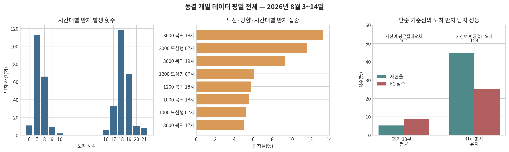
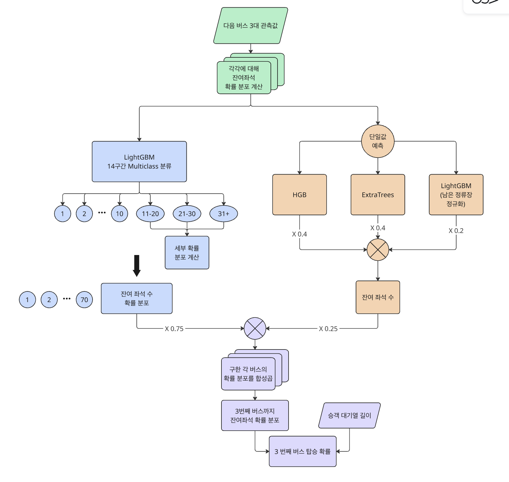
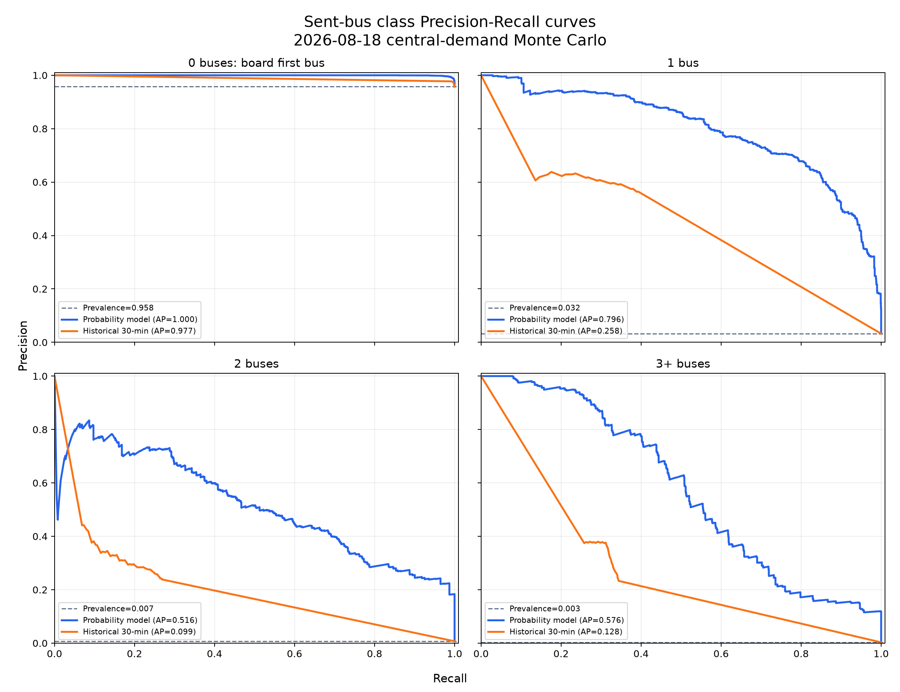
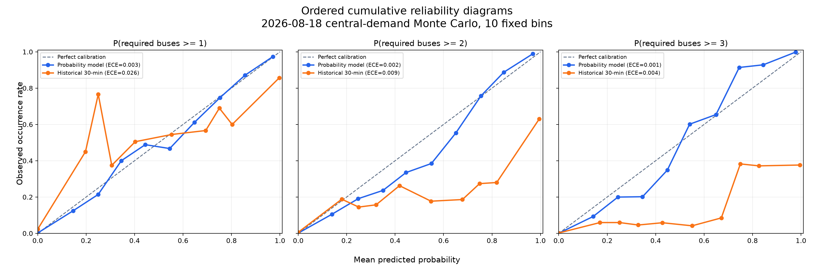
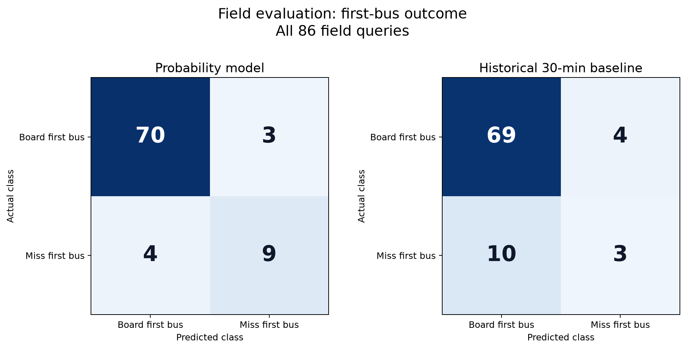

# 대기열과 좌석 불확실성을 고려한 광역버스 탑승 가능성 예측

## 요약

상용 지도앱에서 버스 탑승이 가능한지를 판단하기 위해 사용할 수 있는 정보는 버스가 지금 있는 위치에서 관측된 잔여좌석 뿐이다. 버스가 사용자가 기다리는 정류장까지 오는 동안 앞선 정류장에서 승객이 타면 좌석은 사라지고, 입석이 제한된 광역버스는 만차일 경우 정차하지 않기 때문에, 승객은 대기 후에도 버스를 탑승하지 못하게 된다. 승객은 이전 정류장에서 얼마나 탑승할지 모르기 때문에 지각이나 추가 대기를 감수하지만, 도착 시 탑승 실패 위험을 미리 알면 다른 버스·노선·정류장·출발시각을 선택할 수 있다.

이 문제는 수집한 데이터에서도 확인된다. 2026년 8월 3일부터 14일까지 주말과 공휴일을 제외한 정류장 도착 사건 48,083건 중 만차는 445회 발생했다. 오전 7시에는 113회, 오후 6시에는 118회 발생해 전체 만차의 51.9%가 두 시간대에 집중되었다.

만차 445건 중 374건(84.0%)은 도착 전 관측에서 좌석이 남아 있었고, 이 사례들의 도착 전 최대 잔여좌석 중앙값은 39석이었다. 날짜별로 이전 평일만 사용하는 과거 30분대 평균은 만차 재현율 5.26%, F1 점수 8.70%에 그쳤다. 즉 과거의 기록만으로는 사용자가 피하고 싶은 희소한 탑승 실패를 충분히 경고할 수 없다.

우리는 이러한 문제를 해결하기 위한 다음과 같은 예측 모델을 제시한다. 도착 잔여좌석 앙상블이 제공하는 안정적인 중심값과 14개 구간으로 나눈 좌석 확률분포를 혼합하고, 동시에 보이는 다음 세 대의 분포를 합성곱하여 누적 탑승확률과 탑승 성공 시까지 통과 대수 $[0, 1, 2, 3대 이상]$를 예측한다.

학습에 사용하지 않은 8월 18일 테스트 데이터에 현실적 대기열을 1,000회 결합한 평가에서 주 모델은 과거 30분 기준선보다 RPS를 0.0398에서 0.0172로 56.7% 줄였고, 네 통과 대수 Macro F1은 67.88% 대 47.47%, 첫 버스 탑승 실패 F1은 81.85% 대 54.34%였다.

---

## 1. 현재 잔여 좌석과 도착 시 잔여 좌석의 불일치

### 1.1 시점의 불일치로 인한 탑승 실패

사용자가 앱을 확인하는 시점 $t_0$와 버스가 사용자의 정류장에 도착하는 시점 $t_1$ 사이에는 이동 구간과 여러 상류 정류장이 있다. 현재 잔여좌석 $S(t_0)$은 실시간으로 확인 가능하지만, 사용자가 필요한 정보는 도착 잔여좌석 $S(t_1)$과 자신의 탑승 가능성이다. 그 사이 승하차의 순변화를 $\Delta S(t_0,t_1)$라 하면

$$
S(t_1)=S(t_0)+\Delta S(t_0,t_1)
$$

이다. $\Delta S(t_0,t_1)$는 노선·방향·정류장·시간대와 당일 운행 상태에 따라 달라진다. 따라서 현재 잔여좌석만으로는 목표 정류장에서의 탑승 가능 여부를 판단하기 어렵다. 버스가 목표 정류장에 만차로 도착하면 입석 제한 노선의 승객은 해당 버스를 보내고 다음 버스를 기다려야 한다.

이러한 문제는 2022년 광역버스 입석이 제한된 이후 지속적으로 발생해왔다.

정부는 2024년 광역버스 만차로 인한 무정차 통과를 중간 정류장의 탑승 문제로 제시하고, 중간배차와 좌석예약제 확대 방안을 발표했다. 그러나 이후에도 유사한 문제가 반복되었다. ([국토교통부, 2024 교통 민생토론회](https://www.molit.go.kr/2024plan_traffic/total/total_02.jsp))

2025년 5월 고양시는 본 프로젝트의 수집 대상인 1000번 직행좌석버스가 상류 구간인 일산에서 만차가 되어 하류 구간인 행신동에서 연속적인 탑승 실패가 발생했다고 밝혔다. 이에 입석 금지 전후의 승차 불가 인원 자료를 근거로 전세버스 2대 추가 투입, 중간배차 6회 유지, 2층 전기버스 5대 도입 등의 대책을 시행했다. ([고양특례시](https://www.goyang.go.kr/news/user/bbs/BD_selectBbs.do?q_bbsCode=1090&q_bbscttSn=20250528175838574&q_estnColumn1=All), [뉴시스, 2025-05-28](https://www.newsis.com/view/NISX20250528_0003193302))

2026년 3월에는 경기도 공식 청원 게시판에 광역버스가 평일과 주말 모두 만차로 도착해 다음 차량을 한 시간 이상 기다려야 한다는 청원이 올라왔고 196명이 참여했다. ([경기도청원, 2026-03-16](https://petitions.gg.go.kr/view/?pageid=28&uid=27944))

배차 확대, 중간배차, 좌석예약제는 문제를 일부 해결하지만, 시간대별 수요 편차와 운수종사자 및 차량의 제약으로 인해 모든 정류장의 만차 문제를 제거하기는 어렵다. 따라서 공급 확대와 함께 승객이 버스 도착 전에 탑승 실패 가능성을 확인하고 다른 버스·노선·정류장·출발시각을 선택할 수 있는 정보가 필요하다. 본 프로젝트는 이러한 의사결정을 지원하기 위한 탑승 가능성 예측 방법을 제안한다.

### 1.2 만차의 희소성과 집중

수집 자료에서 만차가 발생하는 양상을 확인하기 위해 2026년 8월 3일부터 14일까지의 평일을 분석하였다. 주말인 8월 8\~9일과 8월 15\~16일, 대체공휴일인 8월 17일은 제외하였다. 8월 18일 자료는 학습에 사용하지 않고 테스트에만 사용하였다.

노선별 수집은 순차적으로 시작되었다. 8월 3\~5일에는 1000번, 8월 6\~7일에는 1000·1100번을 수집하였으며, 6개 노선의 공통 수집 기간은 8월 10\~14일이다. 전체 기간의 48,083건은 만차의 총 관측 규모를 분석하는 데 사용하고, 노선 간 비교에는 공통 기간의 39,616건을 사용하였다. 분석 대상은 1000·1100·1200·1500·2000·3000번이며 제외된 노선은 없다.

| 범위 | 도착 사건 | 만차 사건 | 만차율 |
|---|---:|---:|---:|
| 전체 평일 수집 구간 | 48,083 | 445 | 0.93% |
| 6개 노선 공통 수집 구간 | 39,616 | 372 | 0.94% |
| 오전 7시·전체 평일 | 4,042 | 113 | 2.80% |
| 오후 6시·전체 평일 | 4,613 | 118 | 2.56% |
| 3000번·복귀·오후 6시 | 247 | 33 | 13.36% |
| 3000번·도심행·오전 7시 | 265 | 31 | 11.70% |
| 3000번·복귀·오후 7시 | 299 | 28 | 9.36% |
| 1000번·복귀·오후 6시 | 959 | 53 | 5.53% |

전체 만차율은 0.93%로 낮았으나, 만차는 출퇴근 시간대와 일부 노선·방향에 집중되었다. 오전 7시와 오후 6시에 발생한 만차는 231건으로 전체 445건의 51.9%를 차지하였다. 또한 만차 445건 중 374건(84.0%)은 이전 정류장 관측에서 잔여좌석이 양수였으나 목표 정류장에 도착할 때 만차로 전환된 사례였다. 이들 사례의 도착 전 최대 잔여좌석은 중앙값 39석, 90백분위 44석이었다. 이는 현재 좌석이 충분해 보이는 버스도 목표 정류장에 도착할 때에는 만차가 될 수 있으며, 이러한 사건이 특정 통근 구간에 집중됨을 보여준다.

### 1.3 과거 기록 평균의 한계

두 가지 기준선은 6개 노선이 모두 관측되고 최소 한 평일의 과거 기록이 확보된 2026년 8월 11일부터 14일까지 31,722개 도착 사건에서 순차 검증했다. 각 평가일마다 그 날짜보다 앞선 평일만 사용했으므로 같은 날이나 미래 정보는 평균에 들어가지 않는다.

`과거 30분 평균`은 과거 도착 기록의 노선·방향·목표 정류장·시간대 별 평균을 사용하고, 표본이 없을 때 노선·방향·시간대 → 노선 → 전체 평균 순으로 대체했다. `현재 좌석 유지`는 관측 좌석이 목표 정류장까지 바뀌지 않는다고 가정했다. 평균절대오차와 분류 지표에는 사건마다 총 가중치가 같도록 가중치를 적용했고, 만차 판정 임계값은 예측 좌석 $\le0.5$다. 전체 통합은 노선별 구분 없이 구한 값이며, 노선 평균은 각 노선에 대해 구한 다음 평균값을 계산한 결과이다. 노선 별 수집기간이 달라, 노선에 따른 영향을 고려하기 위해 나누어 계산하였다.

| 기준선·집계 | 전체 MAE | 저잔여($\le10$) MAE | Accuracy | Recall | Precision | F1 |
|---|---:|---:|---:|---:|---:|---:|
| 과거 30분 평균·전체 통합 | 4.83 | 10.09 | 98.94% | 5.26% | 25.00% | 8.70% |
| 과거 30분 평균·노선 평균 | 4.59 | 10.26 | 99.00% | 2.75% | 9.00% | 4.21% |
| 현재 좌석 유지·전체 통합 | 5.98 | 11.40 | 97.43% | 44.72% | 17.36% | 25.01% |
| 현재 좌석 유지·노선 평균 | 5.99 | 14.39 | 97.47% | 39.64% | 14.20% | 19.14% |

만차가 희소하므로 정확도만으로 기준선의 성능을 판단하기 어렵다. 과거 30분 평균은 정확도 98.94%를 기록했으나 실제 만차 304건 중 16건만 탐지하였다. 현재 좌석 유지 기준선은 만차의 44.72%를 탐지했지만, 만차로 예측한 사례의 82.64%가 오경보였다. 따라서 과거 평균이나 현재 상태의 단순 유지보다 현재 위치에서 목표 정류장까지의 좌석 변화를 직접 예측하고, 희소한 탑승 실패 위험을 확률로 제시하는 방법이 필요하다.

### 1.4 실제 선택에 대한 사전 정보의 영향

선행 문헌은 이 정보가 사용자 행동으로 이어질 수 있음을 뒷받침한다. Yap과 Cats(2021)에 따르면, 탑승 거부로 생긴 추가 대기 1분이 최초 대기 1분보다 68% 더 부정적으로 평가됐고, 탑승 거부는 특정 장소·좁은 시간대에 집중되지만 불확실하다. ([DOI](https://doi.org/10.1016/j.tra.2021.02.007)) Islam과 Fonzone(2021)의 에든버러 버스 이용자 조사에서는 실시간 정보를 이용한 사람의 약 55%가 출발시각·탑승시각·정류장·노선 등 여정의 적어도 한 요소를 바꿨다. ([DOI](https://doi.org/10.1016/j.tbs.2021.01.001)) Drabicki, Cats와 Kucharski(2025)는 실시간 혼잡 정보가 있을 때 혼잡한 첫 차량을 타는 대신 좌석 가능성이 높은 다음 차량을 기다리는 선택이 나타남을 보였다. ([DOI](https://doi.org/10.1016/j.tbs.2024.100895))

따라서 서비스가 제공해야 할 정보는 현재 관측된 좌석 수가 아니라, 사용자가 다른 버스·노선·정류장·출발시각을 선택할 수 있는 시점의 탑승 실패 가능성이다.

## 2. 해결 과제의 형식화

사용자보다 앞에 있는 대기 인원을 $q$, 도착 순서에 따른 세 버스의 실제 잔여좌석을 $S_1,S_2,S_3$라 정의한다. 사용자가 $k$번째 버스 이내에 탑승하는 사건을 $B_k$라 하면 탑승확률은 다음과 같다.

$$
P(B_k)=P\left(\sum_{i=1}^{k}S_i \ge q+1\right)
$$

통과 대수 $T$는

$$
T=\min\left\lbrace k-1\middle| \sum_{i=1}^{k}S_i\ge q+1\right\rbrace
$$

이다. 세 번째 버스까지 탑승하지 못한 경우는 `3대 이상`으로 정의한다. 모형의 예측 클래스는 다음과 같다.

| 클래스 | 사용자 의미 | 모델 사건 |
|---:|---|---|
| 0 | 첫 버스 탑승 | $S_1\ge q+1$ |
| 1 | 한 대 통과 | $S_1<q+1\le S_1+S_2$ |
| 2 | 두 대 통과 | $S_1+S_2<q+1\le S_1+S_2+S_3$ |
| 3 | 세 대 이내 탑승 실패 | $S_1+S_2+S_3<q+1$ |

## 3. 관련 문헌

대중교통 혼잡도 예측에 관한 문헌은 차량이 미래 정류장에 도착할 때의 승객 수를 정확히 예측하는 문제에서 출발했다. Wood, Yu와 Gayah(2023)는 실시간 자동승객계수, 운행 정보, 날씨를 이용해 개별 버스의 미래 승객 수를 선형회귀와 랜덤 포레스트로 예측했다. 바로 다음 정류장을 반복해서 예측하는 방식보다 현재 정류장과 목표 정류장의 관계를 직접 학습하는 방식이 하류 정류장에서 더 정확했지만, 다른 시기로의 이전 가능성은 수요 패턴이 안정적일 때 높았다. Gallo, Corman과 Sacco(2022)는 과거 승객 수와 현재 지연에 실시간 차내 승객 관측을 추가하고, 여러 노선의 관계를 함께 학습하는 LightGBM 모형을 제안했다. 실시간 관측은 최대 8\~9개 정류장 앞의 혼잡도 예측을 개선했으나, 승하차 변동이 큰 중심 환승정류장을 지난 뒤에는 예측력이 저하됐다. 두 문헌은 현재 관측을 단순히 유지하는 것보다 하류 구간의 변화를 학습해야 한다는 근거를 제공하지만, 출력은 예상 승객 수나 혼잡 수준이므로 만차처럼 희소한 사건의 확률이나 정류장 대기열에 따른 탑승 성공 여부를 직접 설명하지는 않는다.

차량 혼잡도를 승객에게 의미 있는 정보로 변환하려는 시도도 이루어졌다. Jenelius(2020)는 과거 승객 수와 실시간 차량 위치·승객 수를 결합해 탑승 시 좌석을 얻을 확률, 예상 입석시간, 혼잡으로 증가하는 체감시간을 산출했다. 이는 차량 전체의 평균 혼잡도를 제시하는 데서 나아가 승객의 탑승 정류장과 이동 구간에 맞춘 정보를 제공했다는 점에서 본 프로젝트와 직접 연결된다. 그러나 해당 문헌이 다룬 핵심 사건은 버스에 탑승한 뒤 좌석을 얻는가에 가까우며, 입석이 금지된 광역버스에서 앞선 대기 승객 때문에 차량에 아예 타지 못하는 사건은 별도의 문제다. 또한 한 차량의 좌석 가능성을 넘어 다음 여러 차량까지 얼마나 기다려야 하는지는 출력하지 않는다.

최근에는 혼잡도 예측의 불확실성을 직접 표현하려는 시도가 나타났다. Chen et al.(2025)은 인접 버스의 이동시간과 승객 수를 베이지안 상태전환 시계열 모형으로 함께 예측했다. 이 방법은 버스 운행자료에 나타나는 다봉성과 비대칭성을 확률분포로 표현함으로써 단일한 예상값에 의존하던 기존 방법을 확장했다. 불확실성을 포함한 승객 수 예측이라는 점에서는 본 프로젝트와 가장 가깝지만, 최종 예측 대상은 여전히 차량의 이동시간과 차내 승객 수다. 예측분포를 특정 사용자의 대기순번과 결합해 탑승 성공확률로 변환하거나, 연속해서 도착하는 여러 버스의 좌석을 누적하는 문제는 다루지 않았다.

혼잡 정보가 실제로 승객의 선택을 바꿀 수 있는지도 분석되었다. Drabicki, Kucharski와 Cats(2023)는 다음 두 차량의 혼잡 정보를 받은 승객이 혼잡한 첫 차량을 보내고 다음 차량을 기다리는 행동을 동적 대중교통 모형으로 모의했다. 사례 노선에서는 이러한 정보 제공이 차량별 승객 수를 고르게 분산시키고 탑승 거부와 과밀을 약 40% 줄였다. 이 결과는 예측 정보가 단순한 편의 기능을 넘어 수요를 분산하는 개입이 될 수 있음을 보여준다. 다만 해당 문헌의 관심은 혼잡 정보가 주어졌을 때의 행동과 운행 효과에 있으며, 실제 운행자료로부터 도착 시 좌석분포와 개인별 탑승확률을 만드는 과정 자체는 핵심 분석 대상이 아니었다.

실제 서비스 생태계도 혼잡 정보를 표현하기 시작했다. GTFS Realtime은 차량의 현재 점유상태와 정류장 출발 직후의 예상 점유상태를 전달할 수 있도록 `MANY_SEATS_AVAILABLE`, `FULL`, `NOT_ACCEPTING_PASSENGERS` 등의 값을 정의한다. Google Maps 역시 이용자 제보, 과거 위치 경향, 교통기관의 실시간 자료를 이용한 혼잡도 예측을 여러 국가에 제공한다. 그러나 GTFS의 혼잡도 관련 필드는 선택적·실험적이고 범주 경계도 제공자에게 맡겨져 있다. Google이 공개한 설명만으로도 정류장 도착 시 잔여좌석의 수치분포, 사용자의 대기순번, 확률 보정 방법은 확인하기 어렵다. 따라서 이러한 서비스는 차량이 얼마나 혼잡한지를 전달하지만, 특정 사용자가 그 차량에 탈 수 있는지를 계산하는 공통된 방법까지 제공하지는 않는다.

이상의 문헌은 실시간 차내 상태가 하류 정류장의 혼잡도 예측에 유용하며, 확률분포가 운행 불확실성을 표현하고, 혼잡 정보가 승객의 대기와 경로 선택에 영향을 줄 수 있음을 보여준다. 그러나 선행연구와 현존 서비스의 혼잡도 예측은 주로 차량 내 승객 수, 점유 수준 또는 탑승 후 좌석 확보 가능성을 대상으로 한다. 따라서 좌석이 모두 차면 입석 없이 탑승 자체가 거부되는 광역버스의 제약과, 정류장의 대기순번 때문에 좌석이 일부 남아 있어도 특정 승객이 탑승하지 못하는 상황은 직접적인 예측 대상으로 충분히 고려되지 않았다. 즉 차량이 얼마나 혼잡한지를 예측하는 문제와, 입석이 제한된 차량에 특정 승객이 실제로 탑승할 수 있는지를 예측하는 문제 사이에는 차이가 있다.

특히 현재 잔여좌석을 목표 정류장 도착 시점의 확률분포로 예측하고, 이를 사용자의 앞 대기 인원 $q$ 및 연속해서 도착하는 여러 버스와 결합하여 탑승까지 필요한 차량 수를 산출하는 방법은 충분히 다루어지지 않았다.

본 프로젝트는 좌석 확률분포를 사용자별 탑승 가능성과 예상 통과 대수로 변환한다. 현재 잔여좌석으로부터 목표 정류장 도착 시점의 정수 좌석분포를 추정하고, 사용자의 앞 대기 인원을 탑승 임계값으로 적용한다. 이후 세 버스의 좌석분포를 누적하여 첫 번째·두 번째·세 번째 버스까지의 탑승확률과 예상 통과 대수를 계산한다.

## 4. 확률분포 모형의 필요성

초기 도착좌석 모형은 HGB·ExtraTrees·LightGBM 앙상블을 이용해 전체 평균절대오차를 최소화하도록 설계하였다. 이 모형은 도착 시 잔여좌석을 하나의 값으로 산출하는 단일값 예측 모형이다. 단일값 예측은 좌석 수의 중심 경향을 추정하는 데 유용하지만, 탑승 여부는 잔여좌석과 대기 인원이 만드는 임계값 사건이므로 임계값 주변의 실패확률을 직접 나타내기 어렵다. 구체적인 한계는 다음과 같다.

1. 예측값이 같더라도 만차 위험은 다를 수 있다. 예상 잔여좌석이 5석인 경우에도 확률질량이 $[4,6]$에 집중된 분포와 $[0,10]$에 넓게 분산된 분포는 탑승 실패확률이 서로 다르다.
2. $q+1$을 기준으로 한 1석의 차이가 탑승 성공과 실패를 구분한다. 평균절대오차의 최소화만으로는 이러한 임계값 사건을 직접 최적화할 수 없다.
3. 단일값만으로는 첫 번째 버스의 예측 불확실성을 이후 차량에 전파하여 두 번째·세 번째 버스까지의 누적 탑승확률을 산출하기 어렵다.

이에 본 프로젝트에서는 단일값 모형을 좌석분포의 중심을 추정하는 구성요소로 유지하고, 그 주변의 불확실성을 나타내는 확률분포 모형을 결합하였다.

## 5. 상태유형 단일값 예측 앙상블

단일값 예측 모형에는 45개 입력변수를 사용하였다. 주요 변수군과 역할은 다음과 같다.

| 변수군 | 대표 변수 | 역할 |
|---|---|---|
| 현재 상태 | 현재 좌석, 적재율, 정원 | 예측 시점의 차량 상태 표현 |
| 진행 구조 | 현재·목표 정류장, 남은 정류장 수, 진행률 | 좌석 변화가 누적되는 경로 표현 |
| 최근 동역학 | 직전 좌석 변화, 정류장당 변화, 이동시간 | 현재 운행의 국소 추세 표현 |
| 역사적 위험 | 목표·경로 저잔여율 | 반복되는 시간·공간 위험 |
| 승하차 흐름 | 경로별 승하차 평균·합·표준편차 | 남은 경로의 구조적 좌석 증감 |
| 상태유형 | 기대 좌석, 편차, 저잔여율, 표본수 | 같은 노선·방향·정류장·시간대의 기준 상태 |
| 범주형 맥락 | 노선, 방향, 요일, 시간 구간 | 노선별 운행 패턴 분리 |

단일값 예측 앙상블은 다음과 같다.

| 구성요소 | 가중치 | 예측 대상 |
|---|---:|---|
| HistGradientBoosting | 0.40 | 정류장당 좌석 변화량 |
| ExtraTrees | 0.40 | 정류장당 좌석 변화량 |
| LightGBM | 0.20 | $\sqrt{\text{남은 정류장}}$로 정규화한 변화량 |

서로 다른 트리 계열과 예측 척도를 결합하여 특정 모형의 귀납적 편향에 대한 의존도를 낮추었다. HGB는 전반적인 중심 경향을, ExtraTrees는 비선형 구간을, 제곱근 거리로 정규화한 LightGBM은 이동거리에 따른 오차의 확대를 각각 보완한다.

## 6. 14개 구간 확률분포

탑승확률을 계산하려면 각 잔여좌석에 대한 확률 $P(S=s),\ s=0,\dots,70$이 필요하다. 그러나 71개 좌석값을 직접 분류하면 개별 클래스의 표본이 지나치게 희소해진다. 반대로 넓은 구간만 예측하면 합성곱에 필요한 정수 단위의 좌석 정보를 보존할 수 없다.

따라서 다음의 절차로 구간별 확률을 정수 좌석분포로 변환하였다.

1. 모형은 `0,1,...,10,11–20,21–30,31+`로 구성된 14개 구간의 확률을 예측한다.
2. 각 구간의 확률을 학습 자료에서 관측한 노선별 정수 좌석분포로 확장한다.
3. 해당 노선과 구간의 표본이 없으면 전체 노선의 통합 분포를 사용한다.

이 설계는 잔여좌석 0–10석 구간을 1석 단위로 보존한다. 탑승 임계값에 민감한 저잔여 구간에서는 높은 해상도를 유지하고, 상대적으로 위험이 낮은 중·고잔여 구간에서는 표본을 통합하여 추정의 안정성을 확보하였다.

8월 3~12일 자료로 학습한 LightGBM의 구간별 예측확률은 실제 발생 빈도와 일치하지 않을 수 있다. 이에 학습에 사용하지 않은 다음 평일인 8월 13일의 도착 사건 8,025건을 이용해 원확률과 실제 좌석 구간의 관계를 학습하는 다항 로지스틱 보정기를 적합하였다. 8월 14일 개발 평가 자료와 8월 18일 테스트 자료는 이 과정에 사용하지 않았다.

## 7. 좌석 확률분포와 단일값 예측의 혼합

단일값 예측을 하나의 정수에 모든 확률질량이 집중된 분포로 변환하면 과도하게 확신적인 예측이 된다. 반면 구간별 좌석 확률분포만 사용하면 불확실성과 극단부를 표현하는 데에는 유리하지만, 넓은 구간을 정수 좌석분포로 확장하는 과정에서 개별 사건의 중심값 정밀도가 낮아질 수 있다.

따라서 각 버스의 최종 좌석분포를

$$
P_{mix}(S)=0.75P_{distribution}(S)+0.25\delta_{\hat S_{single}}(S)
$$

로 정의하였다. 확률분포 모형에 0.75의 가중치를 부여하여 예측 불확실성을 유지하고, 단일값 모형에 0.25의 가중치를 부여하여 중심값 정보를 보완하였다. 혼합비는 8월 14일 개발 평가에서 브라이어 점수, 통과 대수 평균절대오차, 로그 손실을 비교하여 결정하였다.

## 8. 누적 좌석분포와 통과 대수 산출

버스별 좌석분포가 서로 독립이라고 가정하면, $k$대의 누적 좌석분포는 합성곱으로 산출할 수 있다.

$$
P(S_1+\cdots+S_k=n)=P(S_1)\ast\cdots\ast P(S_k)
$$

누적 탑승확률에서 통과 대수 확률은 차분으로 계산한다.

$$
\begin{aligned}
P(T=0)&=P(B_1)\\
P(T=1)&=P(B_2)-P(B_1)\\
P(T=2)&=P(B_3)-P(B_2)\\
P(T\ge3)&=1-P(B_3)
\end{aligned}
$$

최종 예측 클래스는 네 클래스 가운데 예측확률이 가장 높은 클래스로 결정하였다. 희소 클래스에 가중치를 부여하는 판정 방식도 검토하였으나, 일부 희소 클래스의 재현율을 높이는 대신 전체 구간에서 통과 대수를 과대추정하는 경향이 나타나 최종 모형에는 적용하지 않았다.

## 9. 최종 평가

### 9.1 사용 자료

평가 대상은 연속적으로 자료를 수집한 1000·1100·1200·1500·2000·3000번 6개 노선의 통합 자료이다. 모든 노선에 동일한 입력변수, 모형, 평가 기준을 적용하였다.

자료 수집을 위해 별도의 GBIS 수집 서버를 구축하였다. 노선·정류장 정보와 차량별 위치·잔여좌석 관측값을 주기적으로 SQLite에 저장하고, 인증된 읽기 전용 API를 통해 분석 환경에 제공하였다. Colab 분석 환경에서는 Google Drive에 저장한 SQLite 캐시를 런타임의 로컬 디스크로 복원한 뒤, 마지막 수집 성공 시점 이후의 자료만 동기화하였다.

| 역할 | 날짜 규칙 | 행/사건 | 사용 목적 |
|---|---|---:|---|
| 확률분포 본 학습 | 2026-08-03~12 완전 평일 | 587,600 / 32,002 | 14개 구간 분류기와 구간 내부 분포 |
| 확률분포 보정 | 2026-08-13 | 161,900 / 8,025 | 다항 확률 보정 |
| 단일값 모형 학습 | 2026-08-03~13 완전 평일 | 749,500 / 40,027 | 상태유형 단일값 예측 앙상블 |
| 상태 조회 이력 | 2026-08-03~14 완전 평일 | 912,802 / 48,083 | 추론 시점 상태유형 조회 |
| 최종 테스트 | 2026-08-18 | 2,784개 질의 사례 × 대기열 1,000회 | 현실적 대기열 몬테카를로 평가 |
| 현장 답사 | 2026-08-21 | 복원 가능 질의 86건 | 실제 대기열·탑승 결과 사후 검증 |

### 9.2 최종 평가 방법과 조건

최종 평가는 학습에 사용하지 않은 8월 18일의 버스 상태 및 도착 잔여좌석에 현실적 대기열 몬테카를로를 결합한 평가와, 8월 21일 현장 답사에서 직접 기록한 대기열 및 탑승 결과에 대한 평가로 구성하였다. 두 평가의 결과는 모형 재학습, 확률 보정, 혼합비 결정 또는 임계값 선택에 사용하지 않았다.

몬테카를로 평가에서 하나의 평가 사례는 사용자가 특정 시점에 특정 정류장에서 다음 세 버스의 탑승 가능성을 조회한 상황을 의미한다. 통과 버스 수 계산에서 $q$는 사용자를 제외한 앞선 대기 인원으로 정의하였다. 조회 시점 이후에는 승객의 추가 도착이나 이탈이 없고, 대기 순서에 따라 잔여좌석 수만큼 탑승하며, 동시에 조회되는 다음 세 버스만 고려한다고 가정하였다. 버스별 좌석 예측분포는 서로 독립인 것으로 근사하여 합성곱하였다. 실제 탑승 클래스는 각 버스가 목표 정류장에 도착했을 때 관측된 잔여좌석을 누적한 뒤 $q+1$과 비교하여 산출하였다. 현장 첫 버스 평가는 이러한 가정으로 정답을 재구성하지 않고, 실제 출발 후 잔류 인원을 사용하였다.

정확도(Accuracy), 균형 정확도(Balanced Accuracy), 거시 F1(Macro F1)은 네 통과 대수 클래스를 평가한다. 첫 버스 실패에 대한 재현율(Recall), 정밀도(Precision), F1은 $S_1<q+1$인 이진 사건을 평가한다. 대표 확률지표인 순위확률점수(Ranked Probability Score, RPS)는 $P(Y\ge1)$, $P(Y\ge2)$, $P(Y\ge3)$의 브라이어 오차를 합산하므로 클래스의 순서와 오분류 거리를 함께 반영하며, 값이 작을수록 성능이 우수하다. 다중분류 브라이어 점수와 로그 손실은 네 클래스의 전체 예측분포를 평가한다. 클래스별 평균 정밀도(Average Precision, AP)는 희소한 통과 대수를 식별하는 능력을, 기대보정오차(Expected Calibration Error, ECE)와 신뢰도 도표는 예측확률과 실제 발생률의 일치 정도를 나타낸다. 기대 통과 대수의 평균절대오차는 세 대 범위로 절단한 실제 통과 대수와 예측 기댓값 사이의 절대오차이다.

[교통카드 빅데이터 통합정보시스템(STCIS)](https://stcis.go.kr)의 자료를 이용한 몬테카를로 실험에는 2026년 7월 1일부터 8월 6일까지 수집된 406개 정류장의 시간대별 승하차 기록 360,240행을 사용하였다. 대기열 분포를 구성할 때에는 미래 정보의 유입을 방지하기 위해 7월 31일까지의 기록만 사용하였다. 정류장·요일·시간별 평균 승차량을 시간당 도착률로 설정하였으며, 해당 조합의 표본이 없는 경우에는 정류장·시간, 정류장 전체, 노선 내 정류장의 시간대 통계 순으로 대체하였다.

교통카드 자료는 정류장 전체의 승차량만 제공하며 노선별 승차량은 제공하지 않는다. 이에 버스 관측자료에서 정류장별 순좌석 감소량의 하한을 산출하여 노선 점유비율을 추정하였다. 동일한 정류장에서 승차와 하차가 동시에 발생하여 순변화가 상쇄되는 문제를 고려해 중앙 시나리오에서는 이 하한에 2.5687을 곱하였고, 1배와 4배를 각각 하한 및 상한 민감도 시나리오로 설정하였다. 승객 도착 수는 군집 도착과 과산포를 표현할 수 있는 감마–포아송 분포에서 추출하였다. 질의 이전 최대 네 대의 버스 사이에 도착한 승객을 누적하고, 각 버스의 실제 잔여좌석만큼 대기열에서 차감하여 질의 시점의 잔류 인원을 산출하였다.

8월 18일 몬테카를로 평가에서는 2,784개 질의 사례마다 노선별 승객 유입과 이전 버스의 처리 결과를 반영한 대기열을 반복별로 새로 생성하였다. 1,000회 반복은 동일한 버스 상태에서 발생할 수 있는 1,000개의 대기열 실현값에 해당한다. 모형 간 대응 비교를 위해 주 모형과 기준선에 반복별로 동일한 대기열을 적용하였다. 비교 기준선은 8월 14일까지의 완전 평일 자료에서 노선·방향·목표 정류장·도착시각의 30분 구간별 평균 좌석을 산출하는 과거 30분 모형이다. 확률분포를 출력하지 않는 기준선은 단일 좌석 예측을 누적 탑승확률 0 또는 1로 변환하였다.

### 9.3 구성요소 제거 실험

단일값 예측과 좌석 확률분포의 역할을 구분하기 위해 8월 14일 개발 자료에서 구성요소 제거 실험을 수행하였다. 좌석 모형은 도착 사건 8,056건을 대상으로 비교하였다. 탑승 모형은 다음 세 대가 동시에 조회되는 질의 3,165건에 $q=[0,1,3,5,10,15,20,30]$을 각각 적용하고, 여덟 대기열 조건에서 산출한 지표의 평균으로 비교하였다. 이 실험은 모형 구조를 결정하기 위한 개발 평가이며, 8월 18일 테스트 자료는 사용하지 않았다.

먼저 두 좌석 모형을 독립적으로 평가하였다. 단일값 예측은 좌석 수의 평균절대오차가 작았으며, 확률분포 모형은 만차 재현율과 만차확률의 브라이어 점수에서 우수하였다. 다만 확률분포의 기댓값을 좌석 수 예측으로 사용하면 넓은 좌석 구간을 정수 단위로 확장하는 과정에서 전체 및 저잔여 좌석의 오차가 증가하였다.

| 좌석 예측 구성 | 전체 MAE | 저잔여($\le10$) MAE | 만차 Accuracy | Recall | Precision | F1 | 만차 Brier |
|---|---:|---:|---:|---:|---:|---:|---:|
| 단일값 예측 | 2.442 | 3.803 | 99.45% | 49.70% | 79.85% | 61.26% | 0.00554 |
| 좌석 확률분포의 기댓값 | 3.741 | 5.256 | 99.24% | 66.05% | 56.01% | 60.62% | 0.00463 |

이러한 차이는 탑승 예측에서도 확인되었다. 단일값 예측만 사용한 모형은 기대 통과 대수 오차와 클래스 정확도가 가장 낮았으나, 하나의 좌석값에 모든 확률질량을 부여하므로 오분류 시 실제 클래스에 거의 0의 확률을 할당하였다. 이에 따라 로그 손실은 확률분포를 사용한 모형보다 약 10배 크게 나타났다. 확률분포만 사용한 모형은 확률 예측의 품질이 개선되었으나 통과 대수의 중심값 오차가 증가하였다. 확률분포 75%와 단일값 예측 25%를 혼합한 모형은 단일값 예측과 유사한 클래스 정확도를 유지하면서 브라이어 점수와 로그 손실이 가장 낮았고, 네 통과 대수 클래스의 거시 F1도 세 구성 가운데 가장 높았다. 다음 표의 첫 버스 실패 F1은 이진 탑승 실패 여부를, 거시 F1은 네 통과 대수 클래스를 평가한 결과이며, 각 지표는 여덟 대기열 조건의 평균이다.

| 탑승 예측 구성 | 기대 통과 대수 MAE | 통과 대수 Accuracy | Macro F1 | 첫 버스 실패 F1 | 누적 탑승 Brier | 통과 대수 로그 손실 |
|---|---:|---:|---:|---:|---:|---:|
| 단일값 예측만 사용 | 0.0448 | 95.85% | 60.33% | 78.33% | 0.01494 | 1.1469 |
| 좌석 확률분포만 사용 | 0.0623 | 95.47% | 58.21% | 74.83% | 0.01170 | 0.1143 |
| 확률분포 75% + 단일값 25% | 0.0576 | 95.76% | 61.39% | 76.66% | 0.01126 | 0.1124 |

혼합 모형의 기대 통과 대수 평균절대오차는 단일값 예측보다 0.0128대 증가하였으나, 누적 탑승 브라이어 점수는 24.6% 감소하였고 통과 대수 정확도의 차이는 0.09%p에 불과하였다. 본 프로젝트의 목적이 확정적인 통과 대수보다 누적 탑승확률을 제공하는 데 있으므로, 이 조합을 최종 모형으로 선정하였다.

### 9.4 8월 18일 대기열 시뮬레이션 몬테카를로 평가

2026년 8월 18일, 6개 노선에서 다음 세 대가 동시에 조회되는 사건 2,784건을 구성하였다. 각 사건은 노선, 방향, 정류장, 질의시각, 이후 세 버스와 실제 도착 잔여좌석이으로 이루어진다. 각 사건에서 감마–포아송 승객 유입과 이전 버스의 처리 이력을 이용해 현실적으로 가능한 대기열을 1,000회 생성하여 총 2,784,000건을 평가하였다. 반복별로 2,784개 사례의 대기열을 새로 생성하였으며, 주 모형과 과거 30분 기준선에는 동일한 대기열을 적용하였다.

중앙 수요 시나리오에서 실제 통과 대수는 첫 버스 탑승 2,665,998건(95.76%), 한 대 통과 90,242건(3.24%), 두 대 통과 19,472건(0.70%), 세 대 이내 탑승 실패 8,288건(0.30%)이었다. 클래스 불균형을 고려하여 정확도뿐 아니라 순서형 확률분포의 RPS, 희소 클래스별 AP, 균형 정확도와 거시 F1을 함께 해석하였다. 전체 통합은 노선별 구분 없이 구한 값이며, 노선 평균은 각 노선에 대해 구한 다음 평균값을 계산한 결과이다. 노선 별 수집기간이 달라, 노선에 따른 영향을 고려하기 위해 나누어 계산하였다.

| 집계·방법 | Accuracy | Balanced Accuracy | Macro F1 | 실패 Recall | Precision | F1 | RPS | Multiclass Brier |
|---|---:|---:|---:|---:|---:|---:|---:|---:|
| 전체 통합·주 모형 | **97.95%** | **64.71%** | **67.88%** | **78.16%** | **85.98%** | **81.85%** | **0.0172** | **0.0299** |
| 전체 통합·과거 30분 | 96.48% | 43.96% | 47.47% | 40.87% | 81.34% | 54.34% | 0.0398 | 0.0653 |
| 노선 평균·주 모형 | **98.06%** | **76.00%** | **54.48%** | **66.99%** | **72.62%** | **69.33%** | **0.0166** | **0.0284** |
| 노선 평균·과거 30분 | 96.72% | 58.21% | 39.26% | 36.08% | 62.96% | 43.27% | 0.0379 | 0.0607 |

통합 RPS는 과거 30분 기준선의 0.0398에서 주 모형의 0.0172로 56.7% 감소하였다. RPS는 $P(Y\ge1)$, $P(Y\ge2)$, $P(Y\ge3)$의 제곱확률오차를 합산하므로, 실제 결과가 세 대 이내 탑승 실패일 때 첫 버스 탑승으로 예측한 경우에 두 대 통과로 예측한 경우보다 큰 벌점을 부여한다. 1,000회 반복에서 산출한 RPS의 95% 구간은 주 모형이 0.0150–0.0197, 기준선이 0.0358–0.0438로 서로 겹치지 않았다.

| 실제 통과 대수 | 발생률 | 주 모형 AP | 과거 30분 AP |
|---|---:|---:|---:|
| 0대·바로 탑승 | 95.76% | **1.000** | 0.977 |
| 1대 통과 | 3.24% | **0.796** | 0.258 |
| 2대 통과 | 0.70% | **0.516** | 0.099 |
| 세 대 이내 탑승 실패 | 0.30% | **0.576** | 0.128 |
| 클래스 평균 | — | **0.722** | 0.366 |

세 희소 실패 클래스 모두에서 주 모형의 정밀도–재현율 곡선이 기준선을 상회하였다. 이는 RPS의 개선이 다수 클래스인 첫 버스 탑승에만 기인하지 않음을 보여준다. 첫 버스 실패 전체에 대한 AP는 주 모형 0.909, 기준선 0.426이었으며, ROC-AUC는 각각 0.994와 0.735였다.

누적 신뢰도 도표는 구간별 평균 예측확률과 실제 발생률을 비교한다. 통합 표본에서 10개 확률 구간으로 산출한 ECE는 $P(Y\ge1)$에서 주 모형 0.0029, 기준선 0.0259였고, $P(Y\ge2)$에서는 각각 0.0022와 0.0087, $P(Y\ge3)$에서는 각각 0.0009와 0.0039였다. 다만 ECE는 표본이 많은 저확률 구간의 영향을 크게 받으므로, 희소 클래스의 성능은 정밀도–재현율 곡선과 RPS를 우선하여 해석하였다. 과거 30분 기준선은 단일값 예측을 0 또는 1의 확률로 변환하므로 로그 손실에서 구조적으로 불리하다. 따라서 최종 비교는 RPS, 브라이어 점수, 정밀도–재현율 곡선 및 분류지표에서 일관되게 나타난 차이에 근거하였다.

### 9.5 실제 답사 데이터 평가

현장 답사 자료는 총 86건의 사건으로 구성된다. 세 차량의 도착 잔여좌석을 모두 확인한 사례에서 두 대 통과와 세 대 이내 탑승 실패는 각각 1건에 불과하여, 네 통과 대수 클래스의 혼동행렬을 안정적으로 해석하기 어려웠다. 따라서 전체 86건을 첫 버스 탑승인 `0대`와 첫 버스 탑승 실패인 `1대 이상`의 이진 분류로 평가하였다. 실제 클래스는 현장에서 기록한 첫 버스 출발 후 잔류 인원의 유무에 따라 결정하였다.

주 모형은 첫 버스 탑승확률이 0.5 미만인 경우를 `1대 이상`으로 판정하였다. 과거 30분 기준선은 8월 14일까지의 자료에서 노선·방향·목표 정류장·도착시각의 30분 구간별 평균 좌석을 산출한 뒤, 이를 반올림하여 대기 인원과 비교하였다.

| 방법 | Accuracy | Balanced Accuracy | 실패 Recall | 실패 Precision | 실패 F1 |
|---|---:|---:|---:|---:|---:|
| 주 모형 | **91.86%** | **82.56%** | **69.23%** | **75.00%** | **72.00%** |
| 과거 30분 기준선 | 83.72% | 58.80% | 23.08% | 42.86% | 30.00% |

실제 첫 버스 탑승은 73건, 탑승 실패는 13건이었다. 주 모형의 혼동행렬은 `[[70, 3], [4, 9]]`, 과거 30분 기준선의 혼동행렬은 `[[69, 4], [10, 3]]`이었다. 주 모형은 실제 실패 13건 중 9건을 탐지한 반면 기준선은 3건을 탐지하였다. 이에 따라 주 모형의 실패 재현율은 기준선보다 46.15%p, F1은 42.00%p 높았다.

현장 평가에는 1000·1200·2000·3000번 노선이 포함되었다. 1100·1500번 노선은 현장 관측이 없어 평가에서 제외하였다.

## 10. 결론

본 프로젝트는 버스의 현재 잔여좌석을 목표 정류장 도착 시점의 확률분포로 변환하고, 이를 사용자의 대기순번 및 이후 세 버스의 누적 좌석과 결합하여 통과 대수별 탑승확률을 산출하였다. 학습에 사용하지 않은 8월 18일의 6개 활성 노선에 현실적 대기열 몬테카를로를 적용한 결과, 주 모형의 RPS는 0.0172로 과거 30분 기준선의 0.0398보다 56.7% 낮았다. 한 대·두 대 통과와 세 대 이내 탑승 실패의 AP, 첫 버스 실패 재현율과 F1에서도 주 모형이 기준선을 상회하였다. 현장 답사 86건을 이용한 첫 버스 탑승 여부 평가에서도 주 모형의 실패 F1은 72.0%로, 기준선의 30.0%보다 높았다.

이 결과는 좌석 수의 단일값 예측만으로는 표현하기 어려운 탑승 실패의 불확실성을 확률분포가 보완하며, 단일값 모형의 중심값 정보가 확률분포의 좌석 수 오차를 보정한다는 점을 보여준다. 특히 클래스 불균형이 큰 상황에서도 순서형 확률지표, 희소 클래스별 지표, 현장 이진 분류 결과가 일관된 방향을 나타냈다는 점에서 사용자별 탑승 가능성 예측의 실효성을 확인하였다.

다만 현장 평가에는 1100·1500번 노선이 포함되지 않았고, 두 대 통과와 세 대 이내 탑승 실패의 관측 사례가 각각 1건으로 제한적이었다. 또한 현재 모형은 질의 이후의 승객 도착과 이탈, 버스 간 좌석 예측오차의 상관관계, 세 대 이후의 대기시간 및 도착예정시간 오차를 명시적으로 반영하지 않는다. 향후에는 활성 노선별 현장 표본을 확대하고, 세 차량의 도착 잔여좌석과 개인 단위 탑승 결과를 함께 수집하여 네 단계 통과 대수 예측을 검증할 필요가 있다.

## 11. 참고 자료

- 고양특례시 (2025-05-28), [고양시, ‘중간배차’와 ‘전세버스’로 시민 출근길 책임진다](https://www.goyang.go.kr/news/user/bbs/BD_selectBbs.do?q_bbsCode=1090&q_bbscttSn=20250528175838574&q_estnColumn1=All): 프로젝트 대상인 1000번이 상류 일산에서 만석이 되어 하류 행신동 승객이 연이어 탑승하지 못한 최근 행정 확인 사례다.
- 뉴시스 (2025-05-28), [‘출근길 서울행 만석버스 문제’ 고양시, 해결 방법은?](https://www.newsis.com/view/NISX20250528_0003193302): 같은 1000번 만차·연속 승차 실패와 중간배차 대응을 보도한 최근 언론 자료다.
- 경기도청원 (2026-03-16), [광역버스 장시간 배차 및 만차로 인한 탑승 불가 문제 개선 요청](https://petitions.gg.go.kr/view/?pageid=28&uid=27944): 만차로 인한 한 시간 이상 대기와 종점 이동 탑승을 호소한 최근 이용자 자기보고 사례다.
- 연합뉴스 (2022-11-18), [경기 광역버스 입석 중단 첫날…출근길 일부 승객 불편](https://www.yna.co.kr/view/AKR20221118032900061): 만차 무정차 통과, 추가 대기와 지각이라는 국내 현장 사례다.
- 대도시권광역교통위원회 (2022), [광역버스 2차 입석대책](https://www.molit.go.kr/mta/USR/N0201/m_36770/dtl.jsp?id=95087157&lcmspage=1): 만차 중간 정류소 문제에 대한 증차·예약·중간출발 정책 근거다.
- 국토교통부 (2024), [교통 분야 민생토론회](https://www.molit.go.kr/2024plan_traffic/total/total_02.jsp): 만차 무정차 통과 해소를 위한 중간배차와 좌석예약제 확대 계획이다.
- Yap & Cats (2021), [Taking the path less travelled: Valuation of denied boarding in crowded public transport systems](https://doi.org/10.1016/j.tra.2021.02.007): 탑승 거부의 추가 대기가 최초 대기보다 더 큰 사용자 비용을 만든다는 실증 근거다.
- Islam & Fonzone (2021), [Bus passenger path choices after consulting ubiquitous real-time information](https://doi.org/10.1016/j.tbs.2021.01.001): 실시간 정보가 출발시각·탑승시각·정류장·노선 선택을 실제로 바꿀 수 있다는 근거다.
- Drabicki, Cats & Kucharski (2025), [Has the COVID-19 pandemic affected travellers' willingness to wait with real-time crowding information?](https://doi.org/10.1016/j.tbs.2024.100895): 혼잡·좌석 정보가 다음 차량 대기라는 대안 선택에 쓰인다는 근거다.
- Jenelius (2020), [Personalized predictive public transport crowding information with automated data sources](https://doi.org/10.1016/j.trc.2020.102647): 승객 개인에게 좌석 획득확률과 예상 입석시간을 제공하는 예측형 혼잡 정보의 직접적인 선행 문헌이다.
- Wood, Yu & Gayah (2023), [Development and evaluation of frameworks for real-time bus passenger occupancy prediction](https://doi.org/10.1016/j.ijtst.2022.03.005): 실시간 운행자료로 개별 버스의 미래 정류장 승객 수를 예측하고 현재–목표 정류장 쌍 모델의 장점을 검증했다.
- Gallo, Corman & Sacco (2022), [Real-time occupancy predictions of public transport vehicles](https://www.research-collection.ethz.ch/entities/publication/9ee774f9-9c41-4fca-a7df-214c5317c999): 과거 정보와 현재 지연만 사용한 경우보다 실시간 차내 인원 관측을 결합한 단기 선행구간 예측을 분석하였다. 현재 관측이 필요하지만 이를 그대로 유지하는 것만으로는 충분하지 않다는 본 프로젝트의 출발점과 연결된다.
- Chen et al. (2025), [Conditional forecasting of bus travel time and passenger occupancy with Bayesian Markov regime-switching vector autoregression](https://doi.org/10.1016/j.trb.2024.103147): 인접 버스의 이동시간과 승객 수를 확률분포로 예측해 다봉성과 비대칭성을 표현했다.
- Drabicki, Kucharski & Cats (2023), [Mitigating bus bunching with real-time crowding information](https://doi.org/10.1007/s11116-022-10270-3): 다음 차량 혼잡 정보가 승객의 의도적 대기와 탑승 거부 감소로 이어질 수 있음을 동적 시뮬레이션으로 보였다.
- Talusan et al. (2022), [On Designing Day Ahead and Same Day Ridership Level Prediction Models](https://arxiv.org/abs/2210.04989): 계획용 예측과 실시간 관측을 사용하는 당일 예측을 구분하는 문헌 흐름을 제공한다.
- MobilityData (GTFS), [GTFS Realtime Reference](https://gtfs.org/documentation/realtime/reference/): 현재·예상 혼잡상태를 교환하는 공개 규격과 그 선택적·실험적 상태를 확인하는 근거다.
- Google Maps (2021), [Navigate new normals with Google Maps](https://blog.google/products-and-platforms/products/maps/new-normals-with-google-maps/): 이용자 제보·과거 경향·기관 자료를 활용한 대규모 혼잡도 안내 서비스 사례다.
