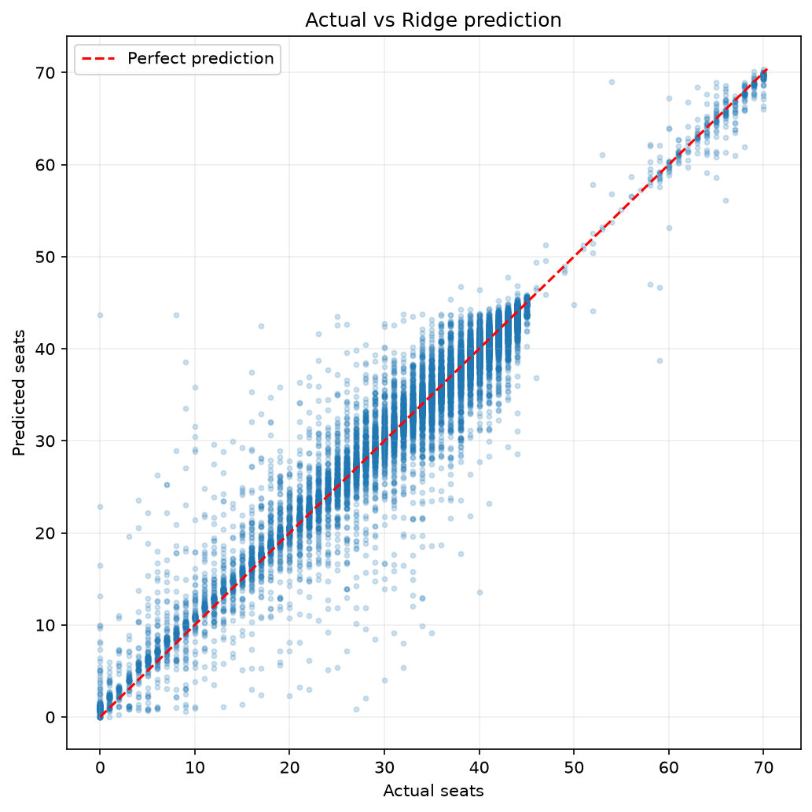
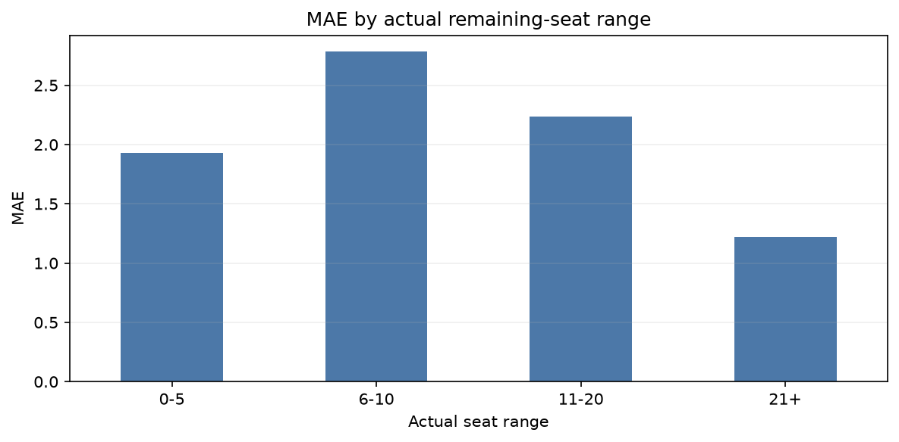
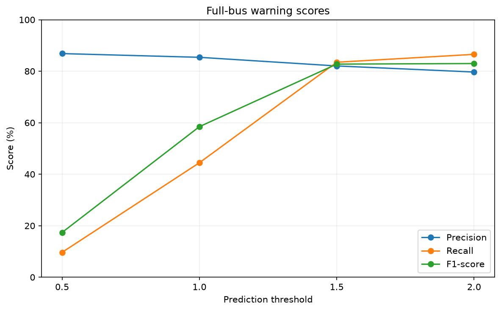
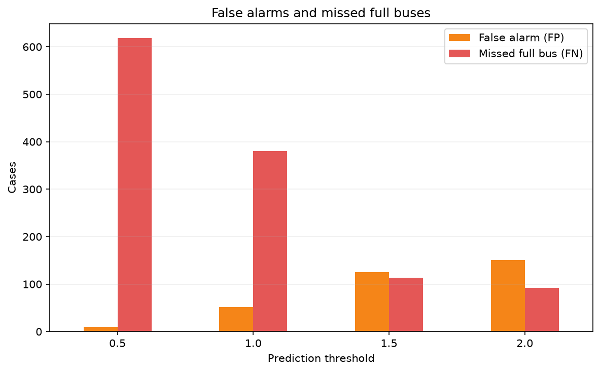
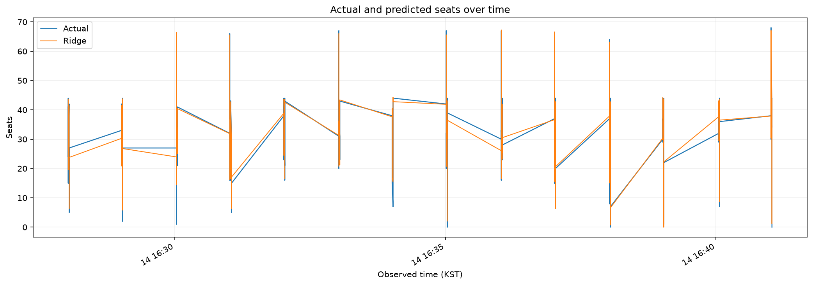
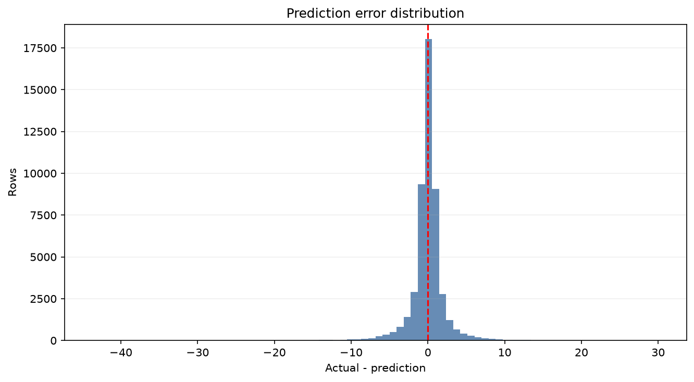
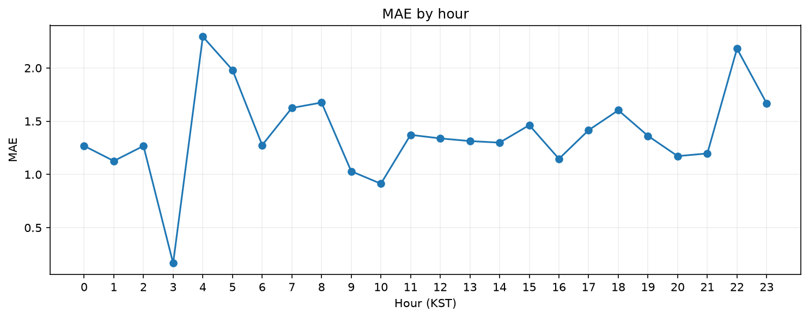
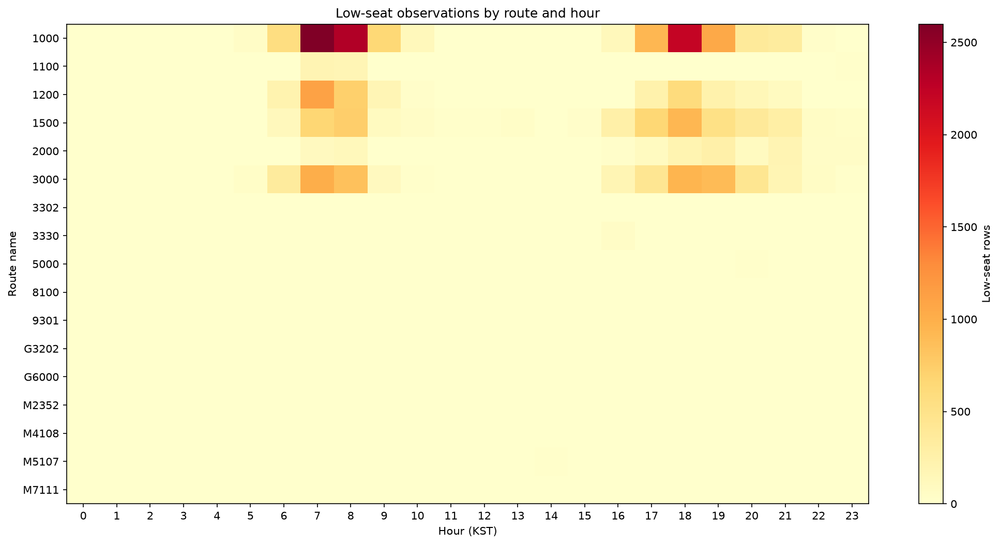
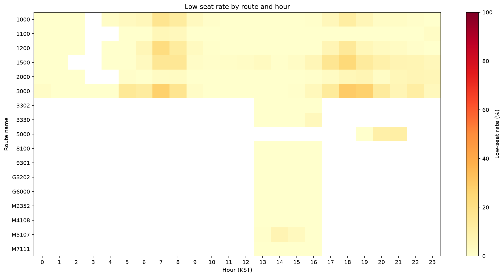
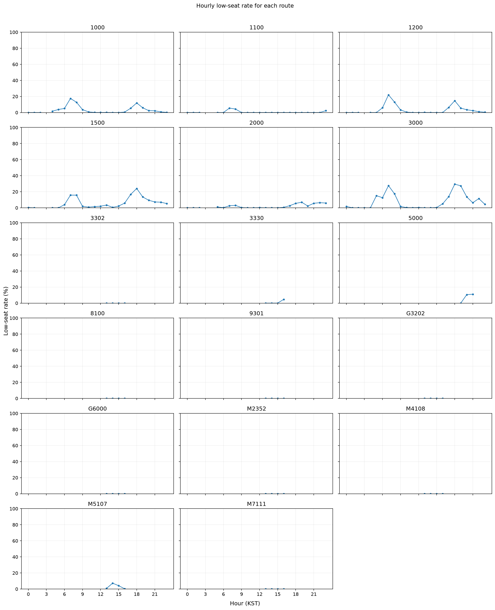

# 잔여좌석 Ridge 모델 실행 가이드

## 1. 실행 순서

프로젝트 루트(`10th-toy-team4`)에서 아래 순서로 실행한다.

1. `sanghyuk/get_data.py`로 각 노선의 최신 버스 데이터를 수집한다.
2. `data/csv/history_all.csv`와 `data/csv/weather_log.csv`가 생성·갱신됐는지 확인한다.
3. Python 스크립트 또는 Jupyter Notebook 중 하나로 분석한다.

프로젝트 루트에서 전체 데이터를 갱신할 때:

```bash
.venv/bin/python sanghyuk/get_data.py --all
```

터미널이 `sanghyuk` 폴더라면:

```bash
../.venv/bin/python get_data.py --all
```

두 경우 모두 `.env`, API 캐시와 CSV 경로는 프로젝트 루트 기준으로 자동 계산된다.

### Python 스크립트 버전

```bash
.venv/bin/python sanghyuk/analyze_and_train.py
```

터미널이 이미 `sanghyuk` 폴더에 있다면 다음과 같이 실행한다.

```bash
../.venv/bin/python analyze_and_train.py
```

실행할 때마다 현재 `data/csv`의 데이터를 다시 읽고, Ridge 모델을 새로 학습·평가한다. 모델과
평가 산출물은 `data/analysis/models`에 저장된다.

### Jupyter Notebook 버전

`sanghyuk/toy_project_models.ipynb`를 열어 위에서부터 셀을 실행한다. 노트북도 현재
`data/csv` 파일을 대상으로 분석하며, 데이터가 갱신된 경우 셀을 다시 실행해야 최신 결과가
반영된다. 노트북의 경로 설정 셀은 프로젝트 루트, `sanghyuk` 폴더 또는 그 상위 작업공간에서
실행해도 `history_all.csv`를 기준으로 프로젝트 루트를 자동 탐색한다.

## 2. 주요 파일

| 파일 | 역할 |
|---|---|
| `sanghyuk/get_data.py` | 버스·날씨 데이터 수집 |
| `data/csv/history_all.csv` | 전체 노선의 버스 관측 이력 |
| `data/csv/weather_log.csv` | 날씨 관측 이력 |
| `sanghyuk/fetch_route_names.py` | 개인 공공데이터 키로 노선번호를 로컬 조회 |
| `sanghyuk/route_names.csv` | `route_id`와 실제 버스 번호(`route_name`)의 로컬 매핑 |
| `sanghyuk/analyze_and_train.py` | 전처리, Ridge 학습 및 평가, 결과 저장 |
| `sanghyuk/toy_project_models.ipynb` | 분석 과정과 결과를 대화식으로 확인 |
| `data/analysis/models/model_report.json` | 상세 평가 결과와 파라미터 |
| `data/analysis/models/predictions.csv` | 전체 테스트 예측값 |
| `data/analysis/models/predictions_within_10.csv` | 실제 잔여좌석 0~10석 테스트 예측값 |
| `sanghyuk/temp_models/ridge_model.joblib` | 공유용 Ridge Pipeline |
| `sanghyuk/temp_models/ridge_model.pkl` | 같은 모델의 pickle 형식 |
| `sanghyuk/temp_models/result.txt` | 핵심 결과 요약 |

## 3. 데이터 처리와 평가 방법

- 같은 차량이 정류장에 머물며 반복 수집된 기록은 한 번의 정류장 방문으로 축약한다.
- 현재 정류장 정보를 입력으로 하고 다음 정류장의 잔여좌석을 목표값으로 만든다.
- 시간 간격이 0.1~30분이고 정류장 순서 차이가 1~5인 정상 이동만 사용한다.
- 날씨는 관측 시각에서 가장 가까운 31분 이내 자료를 결합한다.
- 숫자형 결측치는 학습 데이터 중앙값으로 대체하고, 범주형 결측치는 최빈값으로 대체한다.
- 미래 정보 유출을 줄이기 위해 무작위 분할이 아닌 시간순 앞 80% 학습, 뒤 20% 테스트를 사용한다.

## 4. 모델

현재 사용 모델은 `Ridge(alpha=10.0)` 하나다. 숫자형 변수에는 중앙값 대체와 표준화를,
범주형 변수에는 최빈값 대체와 One-Hot Encoding을 적용한 전체 Pipeline을 저장한다.
Random Forest 모델은 현재 결과가 Ridge보다 좋지 않아 사용 대상에서 제외했다.

## 5. 회귀 평가 결과

| 평가 범위 | MAE | RMSE | R² | ±3석 적중률 | ±5석 적중률 |
|---|---:|---:|---:|---:|---:|
| 전체 테스트 | 1.3412 | 2.4906 | 0.9487 | 89.4857% | 95.3268% |
| 실제 0~10석 | 2.2893 | 4.2910 | -0.4132 | 81.9975% | 90.2589% |

실제 10석 이하를 양성으로 본 분류 결과는 Accuracy 98.7431%, Precision 92.3364%,
Recall 81.2166%, F1-score 86.4203%다.

## 6. 만석 경고 임계값 비교

실제 잔여좌석이 정확히 0석이면 양성이다. Ridge는 연속값을 출력하므로 예측값이 임계값보다
작으면 만석 경고를 발생시키도록 하고, 임계값을 0.5부터 2.0까지 0.5씩 변경했다.

| 경고 조건 | Accuracy | Precision | Recall | F1-score | TP | TN | FP | FN |
|---|---:|---:|---:|---:|---:|---:|---:|---:|
| 예측값 < 0.5 | 98.7290% | 86.8421% | 9.6491% | 17.3684% | 66 | 48,715 | 10 | 618 |
| 예측값 < 1.0 | 99.1257% | 85.3933% | 44.4444% | 58.4615% | 304 | 48,673 | 52 | 380 |
| 예측값 < 1.5 | 99.5183% | 82.0402% | 83.4795% | 82.7536% | 571 | 48,600 | 125 | 113 |
| 예측값 < 2.0 | 99.5082% | 79.6770% | 86.5497% | 82.9713% | 592 | 48,574 | 151 | 92 |

임계값을 높이면 만석을 더 많이 잡아 Recall이 높아지는 대신 오경고가 증가해 Precision이
낮아진다. 균형을 중시하면 `<1.5`, 실제 만석을 놓치지 않는 것이 더 중요하면 Recall과
F1-score가 가장 높은 `<2.0`을 권장한다. Accuracy만으로 선택하면 만석이 아닌 데이터가 매우
많다는 클래스 불균형 때문에 성능을 과대평가할 수 있다.

## 7. 저장 모델 사용 예시

```python
import joblib

model = joblib.load("sanghyuk/temp_models/ridge_model.joblib")
prediction = model.predict(new_data)
full_bus_warning = prediction < 2.0
```

`new_data`에는 학습 때 사용한 입력 열이 있어야 한다. 전처리가 Pipeline에 포함되어 있으므로
별도로 표준화하거나 One-Hot Encoding을 적용하지 않는다.

## 8. Notebook 시각화

`sanghyuk/toy_project_models.ipynb`에는 다음 시각화가 포함되어 있다.

- 실제 잔여좌석과 Ridge 예측값 산점도
- 실제 잔여좌석 구간별 MAE
- 만석 경고 임계값별 Precision, Recall, F1-score
- 만석 경고 임계값별 FP와 FN 건수
- 테스트 데이터의 실제값·예측값 시간 흐름
- 예측 오차 분포
- 시간대별 MAE
- 노선별 시간대 저잔여석 건수 히트맵
- 노선별 시간대 저잔여율 히트맵
- 각 노선의 시간대별 저잔여율 선 그래프

여기서 저잔여석은 실제 잔여좌석이 10석 이하인 관측이고, 저잔여율은 같은 노선·시간대의
전체 관측 중 저잔여석 관측이 차지하는 비율이다. 따라서 건수 히트맵은 실제 발생 규모를,
저잔여율 히트맵은 노선별 관측량 차이를 보정한 혼잡 위험을 보여준다.

노선명은 공유 수집 서버를 변경하지 않고 로컬에서만 조회한다. 공공데이터포털에서 받은
경기도 버스 API 키를 프로젝트 `.env`의 `GBIS_SERVICE_KEY`에 설정한 뒤 실행한다.

```bash
.venv/bin/python sanghyuk/fetch_route_names.py
```

스크립트는 `history_all.csv`의 모든 `route_id`를 조회하여 `sanghyuk/route_names.csv`에
`route_id,route_name` 형태로 저장한다. 노트북 시각화는 이 파일의 `route_name`만 표시한다.
이름이 없으면 ID로 대체하지 않고 조회 명령을 안내한다. 이 과정은 공유 수집 서버, 공용 DB와
다른 사용자의 데이터 수집에 영향을 주지 않는다.

## 9. 저장된 시각화 결과

GitHub는 실행 결과가 저장된 Notebook만 정적으로 표시한다. 환경에 관계없이 주요 결과를
바로 확인할 수 있도록 아래 PNG를 `sanghyuk/visualizations`에 저장했다. Notebook의 각
시각화 셀은 그래프를 표시하는 동시에 대응하는 PNG를 자동으로 덮어쓴다. Notebook을
사용하지 않고 전체 그림만 한 번에 갱신하려면 다음 명령을 실행한다.

```bash
.venv/bin/python sanghyuk/export_visualizations.py
```

### 9.1 실제 잔여좌석과 Ridge 예측값



붉은 점선은 실제값과 예측값이 완전히 같은 지점이다. 점이 대각선 주변에 집중될수록 예측이
정확하며, 대각선에서 멀리 떨어진 점은 큰 오차가 발생한 사례다.

### 9.2 실제 잔여좌석 구간별 MAE



전체 평균만 보지 않고 `0~5`, `6~10`, `11~20`, `21석 이상` 구간별 오차를 비교한다. 서비스상
중요한 저잔여석 구간에서 모델 오차가 얼마나 커지는지 판단하는 그래프다.

### 9.3 만석 경고 임계값별 분류 지표



임계값을 0.5에서 2.0으로 높이면 Recall이 9.65%에서 86.55%로 상승하고 Precision은
86.84%에서 79.68%로 낮아진다. `<1.5`는 Accuracy와 Precision의 균형이 좋고, `<2.0`은
Recall과 F1-score가 가장 높아 만석 누락을 줄이는 목적에 적합하다.

### 9.4 잘못된 경고와 놓친 만석



임계값을 높일수록 놓친 만석인 FN은 618건에서 92건으로 감소하지만 잘못된 경고인 FP는
10건에서 151건으로 증가한다. 실제 서비스에서는 만석 누락 비용과 오경고 비용을 비교해
임계값을 결정해야 한다.

### 9.5 시간순 실제값과 예측값



테스트 데이터의 마지막 500개 관측을 시간순으로 표시한다. Ridge가 잔여좌석 변화의 방향과
급격한 변화를 어느 정도 따라가는지 확인할 수 있다.

### 9.6 예측 오차 분포



오차는 `실제값 - 예측값`이다. 0보다 크면 모델이 실제보다 적게, 0보다 작으면 실제보다 많이
예측한 경우다. 분포의 중심과 꼬리를 통해 편향과 큰 오차 사례를 확인한다.

### 9.7 시간대별 MAE



한국 시간 기준 시간대별 평균 절대오차다. 특정 출퇴근 시간이나 데이터가 적은 시간대에서
성능이 떨어지는지 확인하는 데 사용한다.

### 9.8 노선·시간대별 저잔여석 건수



실제 잔여좌석이 10석 이하인 관측 건수를 버스 번호와 시간대로 집계한다. 수집량이 많은
노선은 건수도 커질 수 있으므로 아래 저잔여율과 함께 해석해야 한다.

### 9.9 노선·시간대별 저잔여율



같은 노선·시간대의 전체 관측 중 10석 이하가 차지하는 비율이다. 흰색 영역은 저잔여율 0%가
아니라 해당 시간대의 관측이 없다는 뜻이다. 현재 데이터에서는 3000번을 비롯한 일부 노선의
오전 7~8시와 오후 17~19시 구간에서 상대적으로 높은 저잔여율이 나타난다.

### 9.10 노선별 시간대 저잔여율 상세



각 버스 번호를 별도 서브플롯으로 나눠 시간대별 저잔여율 변화를 확인한다. 히트맵에서 찾은
혼잡 후보 노선의 시간 패턴을 개별적으로 비교할 때 사용한다.
