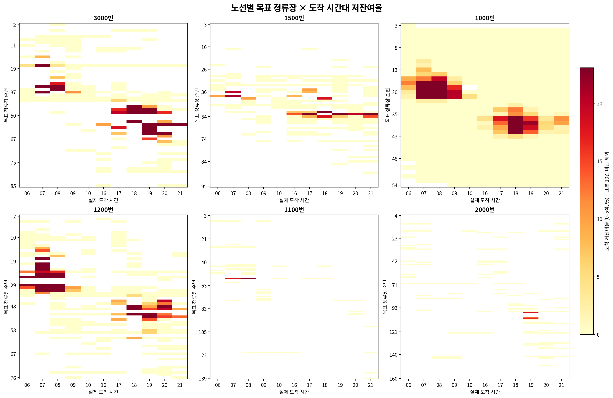
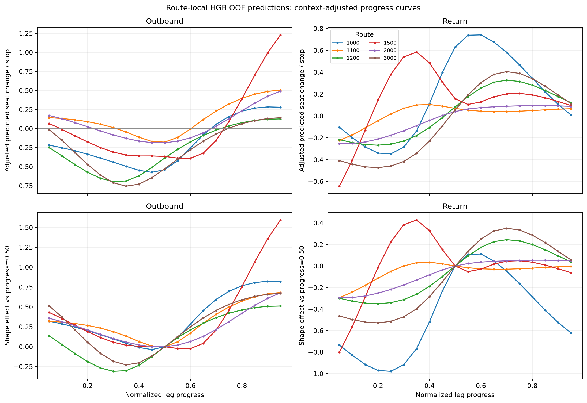
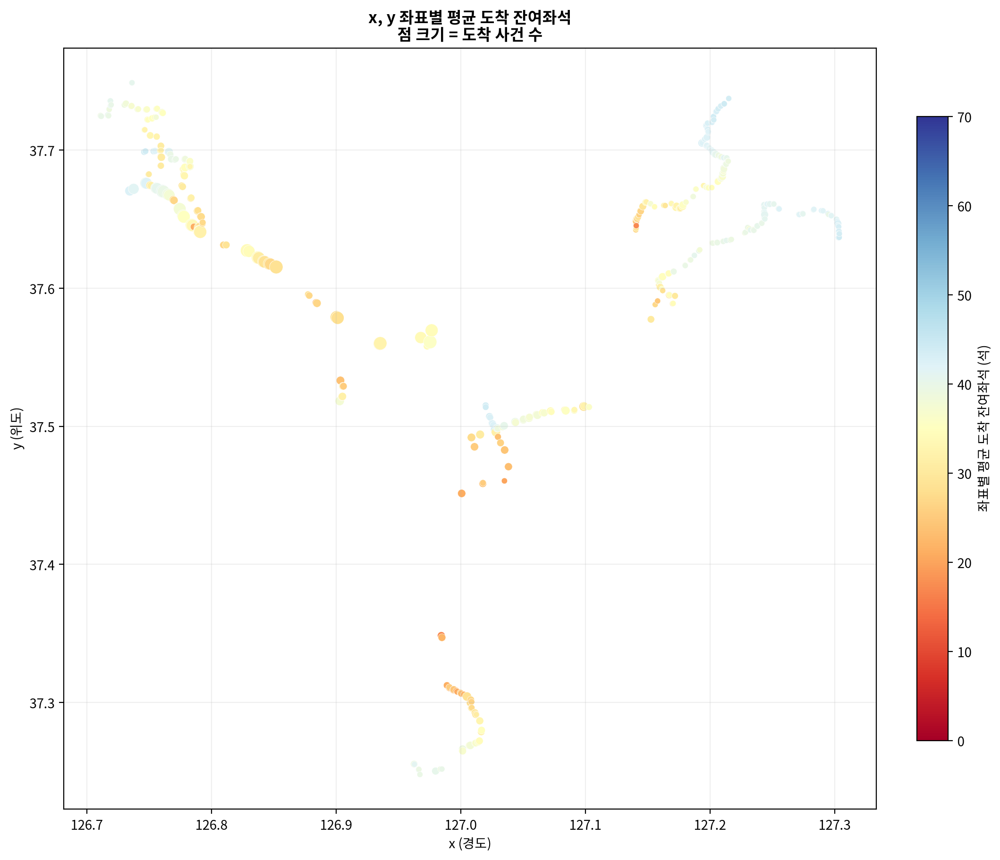
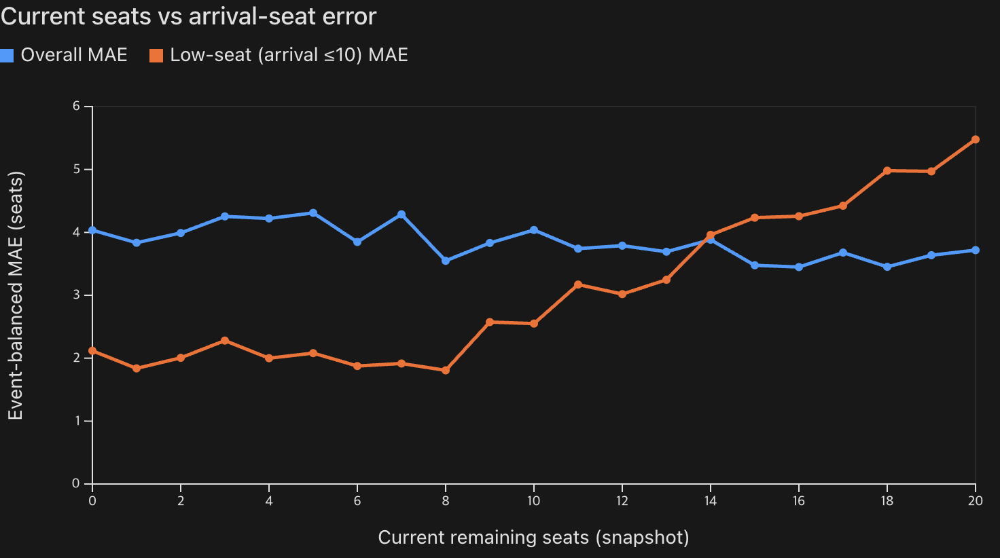

# 도착 전 잔여좌석 예측: 핵심 인사이트 보고서

## 요약

활성 수집 노선 6개(1000, 1100, 1200, 1500, 2000, 3000)를 함께 분석한 결과, 도착 전 잔여좌석은 노선·정류장·시간대·공간 위치와 **도착 전 소진 전환**에 복합적인 영향을 받는다. 이에 따라 주 모델에는 
- 노선과 시간대를 반영하는 피처, 
- 정류장 위도 및 경도 `x`, `y`
를 포함하였고,

전환 사례에는 별도 4배 가중 학습을 실험하여 MAE 개선을 관찰하였으나, 만차 분류에서는 성능 하락이 나타났다.

모든 수치에서 저잔여석 MAE는 실제 도착 잔여좌석이 **10석 이하**인 사건만으로 계산했다. 만석은 실제 잔여좌석 0석, 예측 만석은 예측값 0.5석 미만으로 정의했다.

## 데이터·검증 범위

- 현재 로컬 원천 관측 최신 시각: **2026-08-14 20:22:02 KST**
- 아래의 확정 비교는 각 실험에서 고정한 과거 cutoff를 사용했다. 완성일 OOF 선택은 2026-08-11~12이며, 8/13~14 부분일은 모델 선택 수치에 섞지 않았다.
- 포함 노선: 1000, 1100, 1200, 1500, 2000, 3000.

## 1. 정류장·노선·시간대마다 좌석 분포가 달랐다

- 노선별 도착 저잔여율(0~5석)은 3000번 **5.68%**, 1200번 **3.96%**, 1000번 **2.83%**였지만 1100번은 **0.36%**, 2000번은 **0.35%**였다.
- 각 노선의 고위험 정류장·시간대도 달랐다. 예를 들어 3000번 의왕톨게이트 19시는 10/10건(100%), 1200번 연세대앞 7시는 13/19건(68.4%), 1000번 디지털미디어시티역 7시는 38/73건(52.1%)이었다.
- 통제변수를 동일하게 둔 OOF 진행률 spline 비교에서, 공통 곡선보다 노선별 곡선의 전체 MAE가 **4.272 → 4.091 (0.181석 개선)**되었다. 6노선 × 2완성일의 12개 날짜·노선 비교 모두 개선 방향이었다. 가장 상이한 회차 후 곡선은 1500–1000번(상관 0.083)이었다.

| 진행률 곡선 비교 (2026-08-11~12 OOF) | 공통 곡선 | 노선별 곡선 |
|---|---:|---:|
| 전체 MAE | 4.272 | **4.091** |
| 저잔여석(≤10) MAE | **9.207** | 9.210 |
| 만석 Accuracy | 0.988 | **0.989** |
| 만석 Recall | 0.020 | **0.028** |
| 만석 Precision | 0.171 | **0.363** |
| 만석 F1 | 0.036 | **0.051** |

**반영:** 주 모델의 37개 core 피처에 `route_code`, `direction`, `station_seq_cat`, `snapshot_station_seq_cat`, `snapshot_time_bin_30`, 시간 sin/cos, 진행률을 포함했다. 노선별 진행 구조는 전체 MAE에 유효했지만 저잔여석 MAE 개선 근거는 아니므로, 해당 결과는 추가 수집일로 재검증해야 한다.

## 2. 좌표 `(x, y)`는 위치 고유 특성을 담으므로 유효하다

원시 좌표를 포함한 동일 모델과, 원시 좌표를 제거하고 군집·밀도·군집×시간대 저잔여율 등 공간 의미 피처로 대체한 모델을 비교했다. source cutoff는 **2026-08-14 18:08:03 KST**, 검증은 8/11~12 완료일 OOF다.

| 전체 활성 6노선 pooled OOF | x, y 포함 | x, y 제거·의미 피처 대체 |
|---|---:|---:|
| 전체 MAE | **2.678** | 2.721 |
| 저잔여석(≤10) MAE | **4.744** | 4.948 |
| 만석 Accuracy | **0.9924** | 0.9923 |
| 만석 Recall | **0.368** | 0.347 |
| 만석 Precision | 0.698 | **0.701** |
| 만석 F1 | **0.482** | 0.464 |

`x`, `y`를 제거하면 전체 MAE가 0.043석, 저잔여석 MAE가 0.205석 악화했고 만석 F1도 0.018 하락했다. 즉, 군집·밀도처럼 설계한 요약 피처만으로는 정류장 주변의 미세한 위치 차이를 모두 보존하지 못했다. 따라서 주 모델은 원시 `x`, `y`를 유지한다. 이는 위치 자체가 원인이기 보다, 위치가 승하차·환승·생활권 등의 관측되지 않은 공간 맥락을 대변하기 때문이라고 볼 수 있다.

## 3. 현재는 여유가 있지만 도착 전 소진되는 사례를 별도 강조해야 했다

오차 진단에서 현재 14~20석 부근을 포함한 중간 잔여좌석 구간의 도착 전 MAE가 상승했다. 이미 저잔여석인 차량보다, **현재 11~25석이지만 도착 시 10석 이하가 되는 전환 사례**가 어려웠다. 이 진단을 안정적으로 포함하기 위해 실험의 운영 범위는 11~25석으로 잡았다.

대표 실험 `analysis/low25_transition_weight_experiment.py`는 이 전환 사례에 **4배 sample weight**를 주어 학습한 specialist를 현재 25석 이하에서 기준 모델과 교체해 비교했다. source cutoff는 **2026-08-13 21:00:02 KST**, OOF 선택일은 8/11~12 완료일이며, 전환 사건은 683개다.

그래프는 기준 모델의 도착 전 현재 잔여좌석별 사건 균형 MAE를 보여 준다. 전체 MAE는 약 3.4~4.3석 범위로 비교적 안정적이지만, 실제 도착 잔여좌석이 10석 이하인 저잔여 사례의 MAE는 현재 14석 이후 상승해 20석에서 약 5.5석에 이른다. 즉 이미 좌석이 부족한 차량보다, 현재는 여유가 있어 보이지만 도착 전 소진되는 차량이 더 어려운 예측 대상이다.

| 전환 사례: 현재 11~25석 → 도착 ≤10석 | 기준 모델 | 4× 가중 specialist |
|---|---:|---:|
| 사건 균형 MAE | 4.728 | **4.072** |
| 저잔여석(≤10) MAE | 4.728 | **4.072** |
| 만석 Accuracy | **0.840** | 0.834 |
| 만석 Recall | **0.086** | 0.009 |
| 만석 Precision | **0.521** | 0.192 |
| 만석 F1 | **0.147** | 0.018 |

전환 사례 MAE는 **0.656석(13.9%) 개선**됐고 양의 과대예측 bias도 3.811→2.886으로 줄었다. 반면 만석 분류 Recall/F1은 크게 나빠졌다.
만석 분류에서 지표가 나빠졌기 때문에 해당 모델은 채택하지 않았으나, 유의미한 개선이 있음은 확인할 수 있었다.